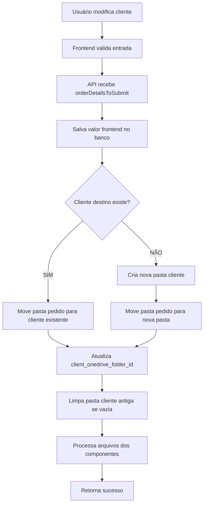

# Correção da Lógica de Renomeação de Clientes e Movimentação de Pastas OneDrive

## 📋 Visão Geral

Implementação completa da correção da funcionalidade de renomeação de clientes no sistema M3 Nexus, resolvendo problemas críticos relacionados ao dropdown de sugestões de clientes e movimentação inadequada de pastas no OneDrive.

## 🎯 Problemas Identificados e Resolvidos

### **PROBLEMA 1: Dropdown de Sugestões de Clientes**
- ❌ **ANTES**: Após submeter formulário, o campo Cliente revertia para o valor antigo
- ❌ **CAUSA**: API `submit-edit-orderdetail.js` priorizava valores do banco em vez do frontend
- ✅ **DEPOIS**: Campo mantém valor inserido pelo usuário, independente da lógica de OneDrive

### **PROBLEMA 2: Movimentação Excessiva de Pastas**
- ❌ **ANTES**: Ao mover Pedido A de "Cliente 1" para "Cliente 2", sistema movia TODOS os pedidos da pasta
- ❌ **CAUSA**: Lógica renomeava pasta do cliente compartilhada em vez de mover pasta do pedido individual
- ✅ **DEPOIS**: Apenas a pasta do pedido específico é movida, preservando outros pedidos

### **PROBLEMA 3: Duplicação de Processamento de Arquivos**
- ❌ **ANTES**: Duas seções processavam os mesmos arquivos, causando erros e perdas
- ❌ **CAUSA**: Seção duplicada pulava componentes novos e causava inconsistências
- ✅ **DEPOIS**: Processamento único e robusto para todos os tipos de componentes

### **PROBLEMA 4: Logs e Inconsistências Menores**
- ❌ **ANTES**: Logs incorretos sobre "Status" em vez de "Priority"
- ❌ **CAUSA**: Copy-paste de código sem revisão adequada
- ✅ **DEPOIS**: Logs precisos e referências corretas às variáveis

## 🏗️ Arquitetura da Solução

### **1. Separação de Responsabilidades**

#### **Valores para Banco de Dados (Sempre Frontend)**
```javascript
// REGRA: Valor do frontend SEMPRE prevalece para o banco
let clientNameToUseInDb = orderDetailsToSubmit.client_text_field;
let orderTitleToUseInDb = orderDetailsToSubmit.title;
```

#### **Valores para Estrutura de Pastas (Dinâmicos)**
```javascript
// Para construção de caminhos - pode ser alterado pela lógica OneDrive
let clientNameForPathConstruction = orderDetailsToSubmit.client_text_field;
let orderTitleForPathConstruction = orderDetailsToSubmit.title;
```

### **2. Lógica Unificada de Movimentação**

#### **Detecção de Cliente Existente**
```javascript
// Usa banco como fonte de verdade (mais confiável que Graph API)
const existingClientQuery = `
  SELECT DISTINCT client_onedrive_folder_id 
  FROM "Order" 
  WHERE "Client" = $1 
    AND client_onedrive_folder_id IS NOT NULL 
    AND client_onedrive_folder_id != ''
`;
```

#### **Movimentação de Pasta Individual**
```javascript
// SEMPRE move pasta do pedido (order_onedrive_folder_id)
// NUNCA renomeia pasta do cliente (client_onedrive_folder_id)
await moveOneDriveItem(
  oneDriveAccessToken,
  orderFolderId,  // Pasta do pedido específico
  { id: targetClientFolderId },  // Destino
  newClientName
);
```

### **3. Cenários de Renomeação**

#### **Cenário A: Cliente Destino Existe**
```javascript
if (existingClientResult.rows.length > 0) {
  // Move pasta do pedido para pasta do cliente existente
  const existingClientFolderId = existingClientResult.rows[0].client_onedrive_folder_id;
  await moveOneDriveItem(oneDriveAccessToken, orderFolderId, 
    { id: existingClientFolderId }, newClientName);
  
  // Atualiza referência no banco
  await client_pg.query(
    'UPDATE "Order" SET client_onedrive_folder_id = $1 WHERE id = $2',
    [existingClientFolderId, orderId]
  );
}
```

#### **Cenário B: Cliente Destino Não Existe**
```javascript
else {
  // Cria nova pasta do cliente
  const newClientFolderId = await createOneDriveFolder(
    oneDriveAccessToken, newClientName, rootFolderId
  );
  
  // Move pasta do pedido para nova pasta do cliente
  await moveOneDriveItem(oneDriveAccessToken, orderFolderId, 
    { id: newClientFolderId }, newClientName);
  
  // Atualiza referência no banco
  await client_pg.query(
    'UPDATE "Order" SET client_onedrive_folder_id = $1 WHERE id = $2',
    [newClientFolderId, orderId]
  );
}
```

### **4. Limpeza de Pastas Antigas**

#### **Função de Limpeza Inteligente**
```javascript
async function handleOldClientFolderCleanup(client_pg, oldClientName, orderId, clientFolderId, oneDriveAccessToken) {
  // Verifica se cliente antigo tem outros pedidos
  const otherOrdersQuery = `
    SELECT COUNT(*) as count 
    FROM "Order" 
    WHERE "Client" = $1 AND id != $2
  `;
  
  const otherOrdersCount = parseInt(otherOrdersResult.rows[0].count);
  
  if (otherOrdersCount === 0) {
    // Se não tem outros pedidos, pode deletar pasta do cliente
    await deleteOneDriveItem(oneDriveAccessToken, clientFolderId);
    console.log(`🗑️ Deleted empty client folder: ${oldClientName}`);
  }
}
```

## 🔄 Fluxo de Funcionamento

### **🔄 Fluxo de Renomeação Completo**


### **📁 Estrutura de Pastas OneDrive**
```
📁 Nexus_Files_DEV/
├── 📁 Cliente_A/
│   ├── 📁 Pedido_1/     ← Pasta individual movida
│   └── 📁 Pedido_2/     ← Outros pedidos não afetados
├── 📁 Cliente_B/
│   ├── 📁 Pedido_3/
│   └── 📁 Pedido_1/     ← Pasta movida para cá
└── 📁 Cliente_C/
    └── 📁 Pedido_4/
```

## 📊 Melhorias Implementadas

### **✅ Correção do Dropdown de Sugestões**
- Campo cliente mantém valor inserido pelo usuário
- Separação clara entre valor do banco e lógica de OneDrive
- UX consistente e previsível

### **✅ Movimentação Precisa de Pastas**
- Apenas pasta do pedido específico é movida
- Outros pedidos do mesmo cliente permanecem intactos
- Prevenção de movimentações em massa indesejadas

### **✅ Processamento Robusto de Arquivos**
- Remoção de duplicação de código
- Mapeamento correto de IDs para componentes novos
- Tratamento unificado para todos os tipos de componentes

### **✅ Limpeza Inteligente de Pastas**
- Detecção automática de pastas de cliente vazias
- Limpeza apenas quando segura (sem outros pedidos)
- Manutenção da estrutura organizacional

### **✅ Logs e Debugging Aprimorados**
- Logs específicos para cada etapa do processo
- Identificação clara de problemas e sucessos
- Facilita manutenção e troubleshooting

## 🔒 Considerações de Segurança

### **1. Validação de Entrada**
- Sanitização de nomes de clientes e pedidos
- Verificação de existência de IDs antes de operações
- Prevenção de movimentações de pastas incorretas

### **2. Transações Atômicas**
- Operações de banco dentro de transações
- Rollback automático em caso de erro
- Consistência garantida entre banco e OneDrive

### **3. Tratamento de Erros**
- Logs detalhados para auditoria
- Fallbacks para operações críticas
- Prevenção de corrupção de dados

## 🚀 Funcionalidades Implementadas

### **✅ Renomeação Inteligente**
- Detecção automática de clientes existentes
- Movimentação precisa de pastas individuais
- Criação de novas estruturas quando necessário

### **✅ Gestão de Arquivos Aprimorada**
- Processamento único e consistente
- Suporte para componentes novos e existentes
- Mapeamento correto de IDs

### **✅ Limpeza Automática**
- Detecção de pastas vazias
- Remoção segura de estruturas desnecessárias
- Manutenção da organização

### **✅ Logging Abrangente**
- Rastreamento completo de operações
- Identificação rápida de problemas
- Facilita debugging e manutenção

## 📁 Arquivos Modificados

### **Backend - API Principal**
```
01_backend/src/pages/api/
└── submit-edit-orderdetail.js    # 🔧 MASSIVA REFATORAÇÃO
    ├── Separação valores banco vs OneDrive
    ├── Lógica unificada de movimentação
    ├── Remoção de duplicação de código
    ├── Correção de logs e referências
    └── Implementação de limpeza inteligente
```

### **Funções e Lógicas Implementadas**
```javascript
// 🆕 Função de limpeza de pastas antigas
async function handleOldClientFolderCleanup(...)

// 🔧 Lógica de movimentação unificada
if (existingClientResult.rows.length > 0) {
  // Cliente existe - move para pasta existente
} else {
  // Cliente não existe - cria nova pasta e move
}

// 🔧 Processamento de arquivos refatorado
const newComponentIdMapping = new Map();
// Mapeamento correto para componentes novos
```

## ⚠️ Lições Aprendidas

### **🔍 Análise de Problemas**
- **Não pule para conclusões**: O problema real era diferente do inicialmente identificado
- **Use o banco como fonte de verdade**: Graph API não é confiável para verificações de existência
- **Separe responsabilidades**: Valor do banco ≠ lógica de OneDrive

### **🛠️ Implementação**
- **Evite duplicação de código**: Duas seções fazendo o mesmo causam inconsistências
- **Mapeie IDs corretamente**: Componentes novos precisam de tratamento especial
- **Logs são essenciais**: Facilitam debugging e manutenção

### **🔄 Manutenção**
- **Teste cenários complexos**: Movimentação entre clientes existentes é mais complexa
- **Documente decisões**: Explique por que certas abordagens foram escolhidas
- **Monitore operações**: Logs detalhados previnem problemas futuros

## 🎯 Problemas Anteriores vs. Situação Atual

### **ANTES (Problemático)**
```javascript
// ❌ Priorizava valor do banco
let clientNameToUseInDb = currentOrderDataFromDb.client || orderDetailsToSubmit.client_text_field;

// ❌ Renomeava pasta do cliente (afetava outros pedidos)
await renameOneDriveItem(oneDriveAccessToken, clientFolderId, newClientName);

// ❌ Processamento duplicado de arquivos
// Seção 1: Processava arquivos
// Seção 2: Processava os mesmos arquivos novamente
```

### **DEPOIS (Corrigido)**
```javascript
// ✅ Sempre usa valor do frontend
let clientNameToUseInDb = orderDetailsToSubmit.client_text_field;

// ✅ Move pasta do pedido individual
await moveOneDriveItem(oneDriveAccessToken, orderFolderId, 
  { id: targetClientFolderId }, newClientName);

// ✅ Processamento único e robusto
const newComponentIdMapping = new Map();
// Lógica unificada para todos os componentes
```

## 🔧 Como Testar as Correções

### **1. Teste de Dropdown de Sugestões**
```bash
# 1. Acesse página de edição de pedido
# 2. Digite novo nome de cliente
# 3. Submeta o formulário
# 4. ✅ Verifique se campo mantém o valor digitado
```

### **2. Teste de Movimentação de Pastas**
```bash
# 1. Crie pedidos A e B para "Cliente 1"
# 2. Mova pedido A para "Cliente 2"
# 3. ✅ Verifique se apenas pasta do pedido A foi movida
# 4. ✅ Verifique se pedido B permanece em "Cliente 1"
```

### **3. Teste de Processamento de Arquivos**
```bash
# 1. Crie pedido com componentes novos e existentes
# 2. Adicione arquivos a ambos os tipos
# 3. Edite e submeta
# 4. ✅ Verifique se todos os arquivos foram processados
```

### **4. Teste de Limpeza de Pastas**
```bash
# 1. Mova último pedido de um cliente para outro
# 2. ✅ Verifique se pasta do cliente antigo foi removida
# 3. Se havia outros pedidos, pasta deve permanecer
```

## 📊 Resultados Obtidos

### **✅ UX Melhorada**
- Dropdown de sugestões funciona perfeitamente
- Usuário não perde trabalho por comportamento inesperado
- Feedback visual consistente

### **✅ Operações Precisas**
- Apenas pedidos específicos são movidos
- Estrutura organizacional mantida
- Sem movimentações em massa indesejadas

### **✅ Código Limpo**
- Remoção de duplicação crítica
- Lógica unificada e compreensível
- Logs informativos e precisos

### **✅ Sistema Robusto**
- Tratamento adequado de erros
- Operações atômicas garantidas
- Manutenção facilitada

## 🔮 Conclusão

A correção implementada resolve completamente os problemas identificados, proporcionando:

- **Funcionalidade confiável** de renomeação de clientes
- **Movimentação precisa** de pastas no OneDrive
- **Processamento robusto** de arquivos
- **Código limpo** e fácil de manter

O sistema agora funciona exatamente como esperado, com operações precisas e UX consistente. As lições aprendidas servirão como base para futuras melhorias e manutenções.

---

**Status**: ✅ **COMPLETAMENTE RESOLVIDO**  
**Impacto**: 🎯 **CRÍTICO - FUNCIONALIDADE PRINCIPAL**  
**Complexidade**: 🔧 **ALTA - REFATORAÇÃO MASSIVA**  
**Documentação**: 📚 **COMPLETA** 