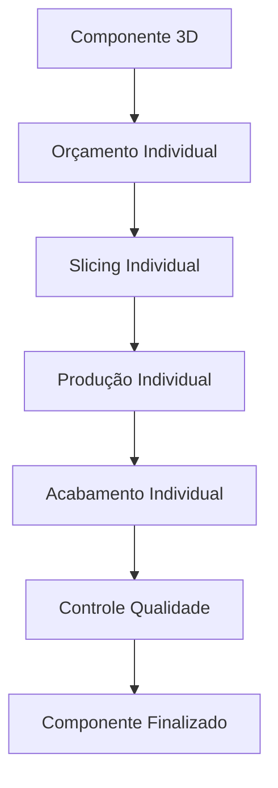
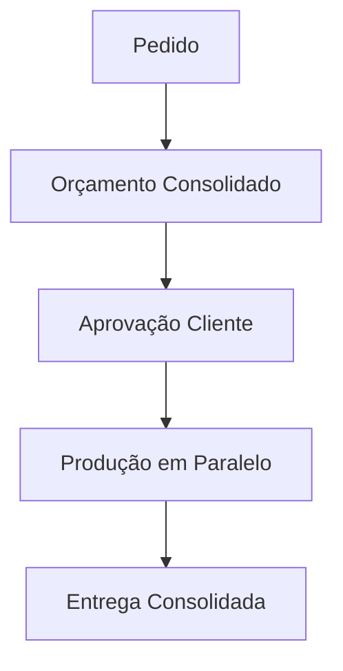

# Arquitetura Component-Centric do M3 Nexus

**Autor:** Thúlio Silva  
**Data:** Janeiro 2025  
**Versão:** 1.0  
**Status:** ✅ Documentação Técnica Completa

---

## 🎯 Objetivo do Documento

Este documento detalha a arquitetura fundamental do sistema M3 Nexus, baseada no conceito de **Component-Centric Design**, explicando como toda a lógica de negócio gira em torno dos "Componentes 3D" e esclarecendo a diferença entre "Componentes 3D" (entidades de negócio) e "Componentes de Tela" (elementos visuais React/Next.js).

---

## 📋 Terminologia Essencial

### **Componente 3D** (Entidade de Negócio)
- **Definição:** Uma peça física individual que será produzida via impressão 3D
- **Exemplos:** Carro em miniatura, capa de celular, caixa de computador, peça de reposição
- **Tabela na BD:** `Component`
- **Características:** Dimensões físicas, material, máquina, tempo de produção, custo

### **Componente de Tela** (Elemento Visual)
- **Definição:** Elementos reutilizáveis da interface React/Next.js
- **Exemplos:** `ClearOrderButton.js`, `SearchBar.js`, `ComponentTab.js`
- **Localização:** `00_frontend/src/components/`
- **Características:** Props, estado, eventos, renderização

### **Pedido/Order** (Agregador Comercial)
- **Definição:** Conjunto de Componentes 3D solicitados por um cliente
- **Tabela na BD:** `Order`
- **Função:** Agregar custos, prazos e status para apresentação ao cliente

---

## 🏗️ Arquitetura Component-Centric

### **Conceito Central: Componente 3D = Unidade Atômica**

Todo o sistema M3 Nexus é construído em torno do conceito de que cada **Componente 3D** é uma unidade independente e atômica de produção. Esta abordagem revoluciona a gestão de processos na indústria de impressão 3D.

```
🎯 FILOSOFIA CENTRAL:
"Cada peça física é uma entidade independente com seus próprios:
- Custos de produção
- Tempos de fabricação  
- Requisitos de material
- Processos de acabamento
- Status de produção"
```

### **Exemplo Prático**

**Cenário:** Cliente solicita um pedido com 3 itens
- 🚗 Carro em miniatura (2 metros) → **Componente 3D #1**
- 📱 Capa de celular → **Componente 3D #2**  
- 💻 Caixa de computador → **Componente 3D #3**

**Cálculo de Custos:**
```
Componente #1 (Carro): €200
Componente #2 (Capa): €10
Componente #3 (Caixa): €100
─────────────────────────
Total do Pedido: €310
```

**Vantagem:** Cada componente pode estar em fases diferentes de produção simultaneamente.

---

## 🔄 Workflow Component-Centric

### **1. Perspectiva Interna (Produção)**


### **2. Perspectiva Externa (Cliente)**


### **3. Flexibilidade de Produção**

**Cenário Real:**
- **Segunda-feira:** Máquina A livre → Produzir Componente #2 (capa)
- **Terça-feira:** Setor acabamento livre → Finalizar Componente #1 (carro)
- **Quarta-feira:** Material específico chegou → Produzir Componente #3 (caixa)

**Resultado:** Otimização máxima de recursos sem dependências rígidas entre componentes.

---

## 🗄️ Estrutura de Base de Dados

### **Tabelas Principais**

#### **Component** (Componente 3D)
```sql
-- Entidade central do sistema
CREATE TABLE "Component" (
    id UUID PRIMARY KEY,
    title VARCHAR(255),                    -- Nome da peça
    dimen_x NUMERIC,                       -- Dimensões físicas
    dimen_y NUMERIC,
    dimen_z NUMERIC,
    min_weight NUMERIC,                    -- Peso estimado
    max_weight NUMERIC,
    material_id UUID,                      -- Material necessário
    machine_id UUID,                       -- Máquina compatível
    parent_component_id UUID,              -- Hierarquia (peça dentro de peça)
    estimated_print_time_minutes INTEGER,  -- Tempo de impressão
    estimated_material_usage NUMERIC,      -- Consumo de material
    version VARCHAR(20),                   -- Controle de versões
    notes TEXT,                           -- Observações técnicas
    -- OneDrive organization
    onedrive_folder_id TEXT,              -- Pasta raiz do componente
    onedrive_clientfiles_folder_id TEXT,  -- Arquivos do cliente
    onedrive_budgets_folder_id TEXT,      -- Orçamentos
    onedrive_forge_folder_id TEXT,        -- Produção
    created_at TIMESTAMP,
    updated_at TIMESTAMP
);
```

#### **ComponentBudget** (Orçamento por Componente)
```sql
-- Orçamento individual de cada peça
CREATE TABLE "ComponentBudget" (
    id UUID PRIMARY KEY,
    component_id UUID REFERENCES "Component"(id),
    forge_id UUID,                        -- Quem vai produzir
    client_id UUID,                       -- Cliente solicitante
    analyst_id UUID,                      -- Analista responsável
    status_id UUID,                       -- Status do orçamento
    version INTEGER,                      -- Versão do orçamento
    
    -- Custos e tempos específicos desta peça
    estimated_forge_days INTEGER,         -- Dias de produção
    estimated_prod_days INTEGER,          -- Dias totais
    final_cost_per_piece NUMERIC,         -- Custo real
    final_price_per_piece NUMERIC,        -- Preço com margem
    
    -- Comentários e observações
    description TEXT,                     -- Descrição técnica
    internal_notes TEXT,                  -- Notas internas
    client_notes TEXT,                    -- Notas para cliente
    
    -- Workflow de aprovação
    analyst_approval_date TIMESTAMP,
    client_approval_date TIMESTAMP,
    send_to_client_date TIMESTAMP,
    
    -- OneDrive organization por versão
    onedrive_folder_id TEXT,              -- Pasta da versão
    onedrive_excel_folder_id TEXT,        -- Planilhas
    onedrive_slice_folder_id TEXT,        -- Arquivos de slice
    onedrive_stl_folder_id TEXT,          -- STL final
    onedrive_slice_images_folder_id TEXT, -- Imagens preview
    
    created_at TIMESTAMP,
    updated_at TIMESTAMP
);
```

#### **Order** (Agregador Comercial)
```sql
-- Container comercial para múltiplos componentes
CREATE TABLE "Order" (
    id UUID PRIMARY KEY,
    client_id UUID,                       -- Cliente solicitante
    seller_id UUID,                       -- Vendedor responsável
    status_id UUID,                       -- Status geral do pedido
    title VARCHAR(255),                   -- Título do pedido
    description TEXT,                     -- Descrição geral
    priority_id UUID,                     -- Prioridade
    production_type_id UUID,              -- Tipo de produção
    created_at TIMESTAMP,
    updated_at TIMESTAMP
);
```

#### **Order_Component** (Relação Many-to-Many)
```sql
-- Liga pedidos aos seus componentes
CREATE TABLE "Order_Component" (
    order_id UUID REFERENCES "Order"(id),
    component_id UUID REFERENCES "Component"(id),
    quantity INTEGER,                     -- Quantidade de cada peça
    PRIMARY KEY (order_id, component_id)
);
```

### **Relacionamentos Chave**

```
Order (1) ←→ (N) Order_Component (N) ←→ (1) Component
                                              ↓
                                        ComponentBudget (1:N)
                                              ↓
                                        ComponentBudgetFiles (1:N)
```

---

## 💰 Sistema de Orçamentos Component-Centric

### **Lógica de Cálculo**

#### **Nível do Componente (ComponentBudget)**
```javascript
// Cálculo individual por peça
const componentCost = {
    materialCost: component.estimated_material_usage * material.cost_per_gram,
    machineCost: component.estimated_print_time_minutes * machine.cost_per_minute,
    laborCost: component.estimated_forge_days * forge.daily_rate,
    finishingCost: component.finishing_requirements * finishing.cost,
    overheadCost: (materialCost + machineCost + laborCost) * overhead_percentage
};

const totalComponentCost = Object.values(componentCost).reduce((a, b) => a + b, 0);
const componentPrice = totalComponentCost * (1 + profit_margin);
```

#### **Nível do Pedido (OrderBudget)**
```javascript
// Agregação de todos os componentes
const orderTotal = order.components.reduce((total, component) => {
    return total + (component.final_price_per_piece * component.quantity);
}, 0);

const orderBudget = {
    subtotal: orderTotal,
    shipping: calculateShipping(order),
    taxes: orderTotal * tax_rate,
    discount: calculateDiscount(order),
    total: orderTotal + shipping + taxes - discount
};
```

### **Vantagens do Sistema**

1. **Granularidade Precisa:** Cada peça tem seu custo exato
2. **Flexibilidade de Preços:** Margens diferentes por tipo de componente
3. **Rastreabilidade:** Histórico completo de custos por peça
4. **Otimização:** Identificação de componentes mais/menos lucrativos
5. **Escalabilidade:** Fácil adição de novos tipos de custos

---

## 🔄 Flexibilidade de Produção

### **Cenário 1: Produção Assíncrona**

**Pedido #123:** 3 componentes
- Componente A: Status "Em Slice"
- Componente B: Status "Em Produção"  
- Componente C: Status "Aguardando Material"

**Vantagem:** Produção não fica bloqueada esperando todos os componentes estarem prontos.

### **Cenário 2: Otimização de Recursos**

**Segunda-feira:**
- Máquina FDM livre → Produzir componentes que usam PLA
- Setor acabamento ocupado → Focar em peças que não precisam acabamento

**Terça-feira:**
- Máquina SLA livre → Produzir componentes de alta precisão
- Setor acabamento livre → Finalizar peças pendentes

### **Cenário 3: Priorização Dinâmica**

```javascript
// Algoritmo de priorização inteligente
const prioritizeComponents = (components) => {
    return components.sort((a, b) => {
        // Fatores de priorização
        const urgencyScore = calculateUrgency(a.deadline, b.deadline);
        const resourceScore = calculateResourceAvailability(a.requirements, b.requirements);
        const profitScore = calculateProfitability(a.margin, b.margin);
        
        return (urgencyScore + resourceScore + profitScore);
    });
};
```

---

## 📊 Benefícios da Arquitetura

### **1. Eficiência Operacional**
- **Paralelização:** Múltiplos componentes em produção simultânea
- **Otimização:** Uso máximo de recursos disponíveis
- **Flexibilidade:** Adaptação rápida a mudanças de prioridade

### **2. Controle Granular**
- **Tracking:** Status individual de cada peça
- **Custos:** Precisão máxima nos cálculos
- **Qualidade:** Controle específico por tipo de componente

### **3. Escalabilidade**
- **Crescimento:** Fácil adição de novos tipos de componentes
- **Complexidade:** Suporte a hierarquias (componente dentro de componente)
- **Reutilização:** Componentes podem ser usados em múltiplos pedidos

### **4. Experiência do Cliente**
- **Transparência:** Visibilidade do progresso de cada peça
- **Flexibilidade:** Modificações em componentes específicos
- **Previsibilidade:** Prazos mais precisos

---

## 🔮 Possibilidades Futuras

### **1. Catálogo de Componentes Padrão**
```javascript
// Componentes pré-definidos com custos conhecidos
const standardComponents = {
    "phone_case_iphone_14": {
        base_cost: 8.50,
        print_time: 45,
        material: "PLA",
        customizable: ["color", "texture", "logo"]
    },
    "miniature_car_scale_1_64": {
        base_cost: 15.30,
        print_time: 120,
        material: "Resin",
        customizable: ["color", "details"]
    }
};
```

### **2. IA para Otimização de Produção**
```javascript
// Sistema inteligente de agendamento
const optimizeProductionSchedule = (components, resources) => {
    // Machine learning para prever melhores sequências
    // Considerando: deadlines, recursos, dependências, custos
};
```

### **3. Marketplace de Componentes**
```javascript
// Plataforma onde clientes podem escolher componentes pré-existentes
const componentMarketplace = {
    categories: ["automotive", "electronics", "home", "toys"],
    filters: ["material", "size", "complexity", "price_range"],
    customization_options: ["colors", "sizes", "personalization"]
};
```

---

## 🛠️ Implementação Técnica

### **APIs Principais**

#### **Gestão de Componentes**
```javascript
// 01_backend/src/pages/api/components/
├── create-component.js          // Criar novo componente 3D
├── update-component.js          // Atualizar especificações
├── get-component-details.js     // Detalhes completos
├── list-components.js           // Listagem com filtros
└── delete-component.js          // Remoção segura
```

#### **Sistema de Orçamentos**
```javascript
// 01_backend/src/pages/api/budgets/
├── create-component-budget.js   // Orçamento individual
├── update-component-budget.js   // Revisões de orçamento
├── approve-component-budget.js  // Aprovações
├── consolidate-order-budget.js  // Agregação por pedido
└── budget-history.js            // Histórico de versões
```

### **Componentes de Tela Principais**

#### **Gestão de Componentes 3D**
```javascript
// 00_frontend/src/components/forms/
├── ComponentForm.js             // Formulário de criação/edição
├── ComponentBudgetForm.js       // Formulário de orçamento
├── ComponentStatusTracker.js    // Tracking de status
└── ComponentHierarchy.js        // Visualização de hierarquia
```

#### **Dashboards**
```javascript
// 00_frontend/src/components/dashboards/
├── ProductionDashboard.js       // Visão geral da produção
├── ComponentStatusBoard.js      // Status de todos os componentes
├── ResourceOptimization.js      // Otimização de recursos
└── ProfitabilityAnalysis.js     // Análise de lucratividade
```

---

## 📝 Conclusão

A arquitetura Component-Centric do M3 Nexus representa uma abordagem inovadora e altamente eficiente para gestão de processos na indústria de impressão 3D. Ao tratar cada **Componente 3D** como uma entidade independente, o sistema oferece:

- **Flexibilidade máxima** na produção
- **Controle granular** de custos e prazos  
- **Otimização inteligente** de recursos
- **Escalabilidade** para crescimento futuro
- **Experiência superior** para clientes

Esta arquitetura não apenas resolve os desafios atuais da produção 3D, mas também estabelece uma base sólida para inovações futuras, incluindo IA, automação e marketplace de componentes.

---

## 📚 Referências Técnicas

- **Base de Dados:** PostgreSQL com estrutura relacional otimizada
- **Backend:** Next.js API Routes com TypeScript
- **Frontend:** React/Next.js com componentes modulares
- **Integração:** Microsoft Graph API para OneDrive
- **Autenticação:** JWT com refresh tokens
- **Monitoramento:** Logs estruturados e métricas de performance

---

**Documento mantido por:** Equipe de Desenvolvimento M3 Nexus  
**Última atualização:** Janeiro 2025  
**Próxima revisão:** Março 2025