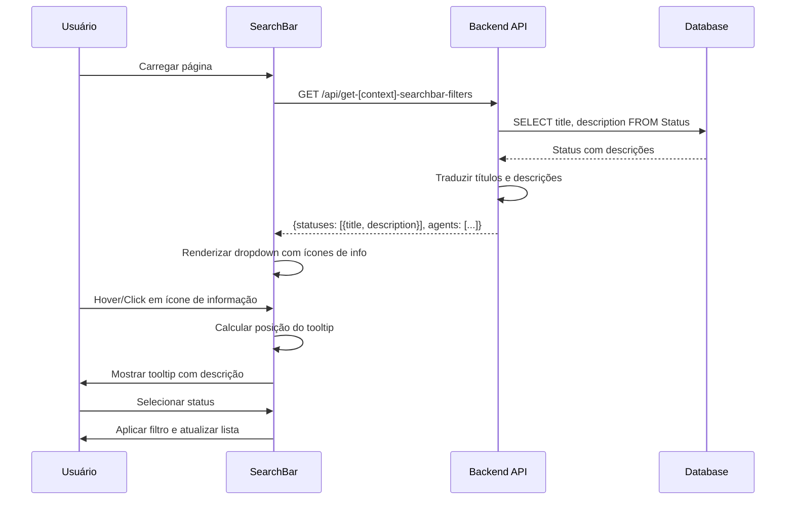
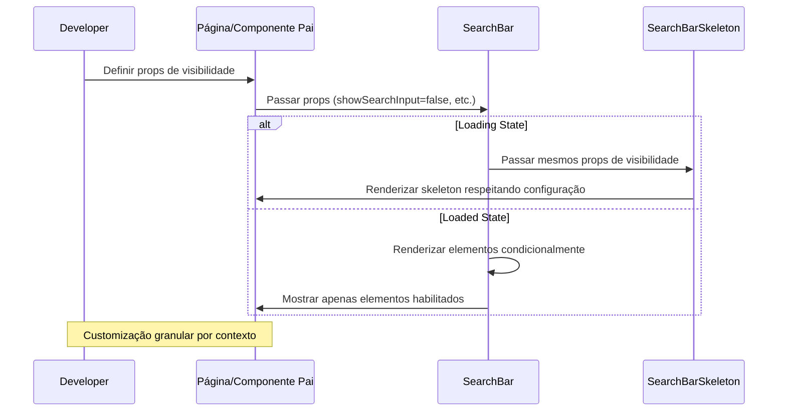
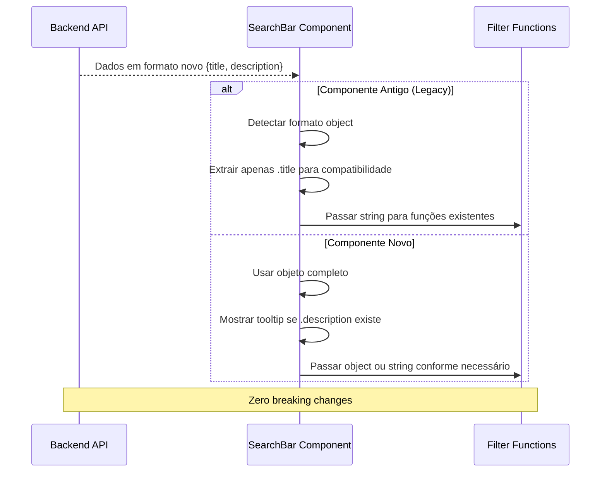

# SearchBar Component - Sistema de Filtros e Tooltips Completo

**Autor:** Thúlio Silva

## 🎯 Objetivo Principal

Criar um componente SearchBar robusto e reutilizável com controle granular de visibilidade de elementos, sistema de tooltips informativos para status, e compatibilidade total com implementações existentes, melhorando significativamente a experiência de filtragem em todas as páginas de listagens.

## 📋 Resumo da Solução

### **Problema Inicial**
- Componente SearchBar rígido sem controle de visibilidade dos elementos
- Falta de informações contextuais sobre os status disponíveis
- Inconsistência visual entre diferentes páginas de listagens
- Dificuldade para customizar filtros por contexto específico
- Ausência de feedback informativo sobre significado dos status

### **Solução Implementada**
- **Props granulares** para controle individual de cada elemento (show/hide)
- **Sistema de tooltips** com descrições dos status da base de dados
- **Compatibilidade total** com implementações existentes (old/new format)
- **Posicionamento inteligente** dos tooltips com responsividade
- **API unificada** com tradução automática de descrições
- **Skeleton loading** que respeita configurações de visibilidade

---

## 🏗️ Arquitetura da Solução

### **1. Componente Principal - SearchBar.js**
```javascript
// Localização: 00_frontend/src/components/lists/searchbars/SearchBar.js
- Props granulares para controle de visibilidade (showSearchInput, showSortButton, etc.)
- Sistema de tooltips com posicionamento dinâmico e responsivo
- Compatibilidade com formatos antigos (strings) e novos (objects) de status
- Estados separados para animações de dropdown e tooltip
- Detecção automática de descrições para mostrar ícones de informação
```

### **2. Skeleton de Loading - SearchBarSkeleton.js**
```javascript
// Localização: 00_frontend/src/components/ui/loadingskeletons/SearchBarSkeleton.js
- Espelha exatamente a estrutura do componente principal
- Respeita todas as props de visibilidade
- Dimensões fixas e determinísticas para evitar layout shifts
- Renderização condicional baseada nos mesmos props do SearchBar
```

### **3. APIs de Backend**
```javascript
// get-searchbar-filters.js - Listagem geral (Admin)
// get-prod-searchbar-filters.js - Ordens de produção  
// get-approval-searchbar-filters.js - Ordens para aprovação
- Query unificada: SELECT title, description FROM "Status"
- Filtragem específica por contexto usando coluna "order"
- Tradução automática de títulos e descrições
- Retorno em formato {title, description} para suporte a tooltips
```

### **4. Páginas de Implementação**
```javascript
// Admin: 00_frontend/src/app/admin/orderslist/page.js
// Forge: 00_frontend/src/app/forge/ (productionorders, budgetsforapproval)
// Agent: 00_frontend/src/app/agent/myorders/page.js
- Integração com novas APIs que incluem descrições
- Lógica de filtro atualizada para lidar com formato object/string
- Estados de loading sincronizados com filtros
```

---

## 🔧 Implementação Detalhada

### **1. Sistema de Props Granulares**

#### **Props de Controle de Visibilidade**
```javascript
// Todos os props têm valor padrão true para compatibilidade
const SearchBar = ({
  // Controles principais
  showSearchInput = true,        // Barra de pesquisa principal
  showSortButton = true,         // Botão "Mais velho primeiro"
  
  // Filtros de contexto  
  showDateRange = true,          // Filtro de data de criação
  showStatusFilter = true,       // Dropdown de status com tooltips
  showAgentFilter = true,        // Filtro de comercial/agente
  
  // Filtros de opções de pedido
  showUrgentFilter = true,       // Pilula "Urgente"
  showPartnerFilter = true,      // Pilula "Cliente Parceiro" 
  showSampleFilter = true,       // Pilula "Amostra"
  showScanFilter = true,         // Pilula "Digitalização"
  showShippingFilter = true,     // Pilula "Frete"
  showInHandFilter = true,       // Pilula "Em Mãos"
  
  // ... outros props existentes
}) => {
```

#### **Lógica de Renderização Condicional**
```javascript
// Renderização condicional de elementos individuais
{showSearchInput && (
  <div className="relative flex-grow w-full sm:w-auto">
    {/* Conteúdo da barra de pesquisa */}
  </div>
)}

// Renderização condicional de seções inteiras
{(showSortButton || showDateRange || showStatusFilter || showAgentFilter) && (
  <div className="flex flex-wrap gap-2 w-full pb-3 pt-3">
    {/* Filtros da primeira linha */}
  </div>
)}
```

### **2. Sistema de Tooltips para Status**

#### **Estados de Controle**
```javascript
// Estados específicos para tooltips
const [showStatusDescription, setShowStatusDescription] = useState({});
const [activeInfoButton, setActiveInfoButton] = useState(null);
const [tooltipPosition, setTooltipPosition] = useState({ 
  top: 0, left: 0, buttonLeft: 0, width: 320 
});
```

#### **Compatibilidade de Formatos**
```javascript
// Suporte a formato antigo (strings) e novo (objects)
statuses.map((status, index) => {
  // Verificação de nulos para prevenir erros
  if (!status) return null;
  
  // Extração de dados compatível com ambos os formatos
  const statusTitle = typeof status === 'string' ? status : status.title;
  const statusDescription = typeof status === 'object' && status ? status.description : null;
  
  // Pular se não há título válido
  if (!statusTitle) return null;
  
  return (
    <div onClick={() => handleStatusSelect(statusTitle)}>
      <span>{statusTitle}</span>
      {/* Ícone de informação apenas se há descrição */}
      {statusDescription && (
        <button onMouseEnter={showTooltip} onClick={toggleTooltip}>
          <InfoIcon />
        </button>
      )}
    </div>
  );
}).filter(Boolean) // Remove elementos nulos
```

#### **Posicionamento Inteligente do Tooltip**
```javascript
// Cálculo de posição responsiva
const rect = e.currentTarget.getBoundingClientRect();
const viewportWidth = window.innerWidth;
const isMobile = viewportWidth < 768;

// Largura adaptável baseada no dispositivo
const tooltipWidth = isMobile ? Math.min(280, viewportWidth - 40) : 320;

// Prevenção de overflow horizontal
let left = rect.left;
if (left + tooltipWidth > viewportWidth) {
  left = Math.max(10, viewportWidth - tooltipWidth - 10);
}

// Offset vertical para mobile
const topOffset = isMobile ? 10 : 5;

setTooltipPosition({
  top: rect.bottom + topOffset,
  left: left,
  buttonLeft: rect.left + (rect.width / 2), // Para posicionamento da seta
  width: tooltipWidth
});
```

#### **Renderização do Tooltip**
```javascript
{/* Tooltip com fundo branco e seta */}
{Object.entries(showStatusDescription).some(([_, show]) => show) && (
  <div 
    className="fixed z-[9999] pointer-events-none bg-white"
    style={{
      top: `${tooltipPosition.top}px`,
      left: `${tooltipPosition.left}px`,
      width: `${tooltipPosition.width}px`,
    }}
  >
    <div className="p-3 rounded-lg shadow-lg text-sm leading-relaxed border border-gray-200">
      {/* Conteúdo dinâmico baseado no status ativo */}
      <p className="font-medium text-gray-500 mb-1">{statusTitle}</p>
      <p className="text-gray-500">{description}</p>
    </div>
  </div>
)}
```

### **3. APIs Backend Unificadas**

#### **Query Base Unificada**
```sql
-- Todas as APIs usam a mesma estrutura base
SELECT title, description 
FROM "Status" 
WHERE for_budget = false 
  AND [filtro_específico_por_contexto]
ORDER BY "order" ASC, title ASC;
```

#### **Filtros Específicos por Contexto**
```javascript
// get-searchbar-filters.js (Admin - Listagem Geral)
// SEM filtro adicional - mostra todos os status

// get-prod-searchbar-filters.js (Produção)  
WHERE for_budget = false AND "order" >= 3

// get-approval-searchbar-filters.js (Aprovação)
WHERE for_budget = false AND ("order" = 2 OR "order" = 3)
```

#### **Sistema de Tradução**
```javascript
// Tradução automática de títulos e descrições
const translatedStatusData = [];
if (language !== 'en') {
  for (const status of statusData) {
    if (status.title) {
      const translatedTitle = await translateText(status.title, language);
      let translatedDescription = null;
      
      // Traduzir descrição se existir
      if (status.description) {
        translatedDescription = await translateText(status.description, language);
      }
      
      translatedStatusData.push({
        title: translatedTitle,
        description: translatedDescription
      });
    }
  }
} else {
  // Inglês: usar dados originais
  translatedStatusData.push(...statusData.filter(status => status.title));
}
```

### **4. Integração nas Páginas**

#### **Tratamento de Dados nas Páginas**
```javascript
// Nas páginas de listagem (orderslist, etc.)
useEffect(() => {
  const fetchFilterOptions = async () => {
    setIsLoadingFilters(true);
    try {
      const response = await axiosInstance.get('/api/get-searchbar-filters');
      if (response.data?.success && response.data.data) {
        const { statuses, agents } = response.data.data;
        // Agora statuses pode ser array de objects {title, description}
        setAvailableStatuses(Array.isArray(statuses) ? statuses : []);
        setAvailableAgents(Array.isArray(agents) ? agents : []);
      }
    } catch (err) {
      console.error("Error fetching filter options:", err);
    } finally {
      setIsLoadingFilters(false);
    }
  };
  
  fetchFilterOptions();
}, [language]);
```

#### **Lógica de Filtro Compatível**
```javascript
// Filtro que funciona com string ou object
if (selectedStatus) {
  result = result.filter(order => {
    if (!order?.status_title) return false;
    
    // Formato string (antigo)
    if (typeof selectedStatus === 'string') {
      return order.status_title === selectedStatus;
    }
    
    // Formato object (novo)
    if (typeof selectedStatus === 'object' && selectedStatus?.title) {
      return order.status_title === selectedStatus.title;
    }
    
    return false;
  });
}
```

#### **Handler de Mudança de Status**
```javascript
const handleStatusChange = useCallback((status) => {
  setSelectedStatus(prevSelectedStatus => {
    if (!status) return null;
    
    // Comparação compatível com ambos os formatos
    const currentTitle = typeof prevSelectedStatus === 'string' 
      ? prevSelectedStatus 
      : prevSelectedStatus?.title;
      
    const newTitle = typeof status === 'string' 
      ? status 
      : status?.title;
    
    // Toggle: se mesmo status, limpa; senão, seleciona novo
    return currentTitle === newTitle ? null : status;
  });
  setCurrentPage(1);
}, []);
```

---

## 🎨 Funcionalidades de UX/UI

### **✅ Responsividade Completa**
- **Desktop**: Tooltips de 320px com posicionamento otimizado
- **Mobile**: Largura máxima de 280px respeitando margens de 20px
- **Adaptação automática**: Layout flexível que se ajusta ao conteúdo visível

### **✅ Feedback Visual Rico**
- **Ícone de informação**: Círculo com "i" para status com descrição
- **Estados de hover**: Transições suaves em botões e ícones
- **Loading skeleton**: Espelha exatamente o layout final
- **Animações fluidas**: Dropdowns e tooltips com animações de entrada/saída

### **✅ Interação Intuitiva**
- **Hover temporário**: Tooltip aparece no hover e desaparece ao sair
- **Click persistente**: Tooltip fica fixo ao clicar, permite leitura
- **Click fora**: Fecha tooltip automaticamente
- **Prevenção de conflitos**: Apenas um tooltip visível por vez

### **✅ Acessibilidade**
- **Contraste alto**: Texto escuro em fundo claro para melhor legibilidade
- **Hierarquia visual**: Título em negrito, descrição em peso normal
- **Interação por teclado**: Tooltips acessíveis via keyboard navigation
- **Estados focáveis**: Elementos interativos claramente indicados

---

## 📊 Fluxos de Funcionamento

### **🔍 Fluxo de Filtragem com Tooltips**


### **📱 Fluxo de Customização de Visibilidade**


### **🔄 Fluxo de Compatibilidade de Formatos**


---

## 🚀 Funcionalidades Implementadas

### **✅ Controle Granular de Visibilidade**
- 11 props individuais para cada elemento do SearchBar
- Seções ocultas automaticamente quando todos os elementos estão escondidos
- Skeleton loading que espelha configurações de visibilidade
- Compatibilidade total com implementações existentes

### **✅ Sistema de Tooltips Inteligente**
- Ícones de informação aparecem apenas quando há descrição
- Posicionamento responsivo com prevenção de overflow
- Interação dual: hover temporário + click persistente
- Visual moderno com fundo claro e boa legibilidade

### **✅ APIs Backend Unificadas**
- Três endpoints especializados por contexto
- Query base consistente com filtragem específica
- Tradução automática de títulos e descrições
- Tratamento robusto de valores nulos

### **✅ Compatibilidade Total**
- Suporte a formato antigo (array de strings)
- Suporte a formato novo (array de objects)
- Detecção automática de formato
- Zero breaking changes em código existente

### **✅ UX/UI Polida**
- Animações fluidas em dropdowns e tooltips
- Feedback visual imediato
- Design responsivo para todos os dispositivos
- Estados de loading consistentes

---

## 📁 Arquivos Modificados/Criados

### **Frontend - Componentes**
```
00_frontend/src/components/lists/searchbars/
├── SearchBar.js                           # ✏️ Major update - Props + Tooltips
└── 

00_frontend/src/components/ui/loadingskeletons/
└── SearchBarSkeleton.js                   # ✏️ Updated - Visibility props
```

### **Frontend - Páginas**
```
00_frontend/src/app/admin/orderslist/
└── page.js                                # ✏️ Updated - New status format

00_frontend/src/app/forge/productionorders/
└── page.js                                # ⚠️ Needs update for consistency

00_frontend/src/app/forge/budgetsforapproval/
└── page.js                                # ⚠️ Needs update for consistency
```

### **Backend - APIs**
```
01_backend/src/pages/api/
├── get-searchbar-filters.js               # ✏️ Updated - Added descriptions
├── get-prod-searchbar-filters.js          # ✏️ Updated - Added descriptions  
└── get-approval-searchbar-filters.js      # ✏️ Updated - Added descriptions
```

---

## 🎯 Exemplos de Uso

### **1. Configuração Minimalista (Apenas Pesquisa)**
```jsx
<SearchBar
  placeholder="Pesquisar pedidos..."
  initialSearchTerm={searchTerm}
  onSearchTermChange={handleSearchTermChange}
  
  // Ocultar todos os filtros
  showSortButton={false}
  showDateRange={false}
  showStatusFilter={false}
  showAgentFilter={false}
  showUrgentFilter={false}
  showPartnerFilter={false}
  showSampleFilter={false}
  showScanFilter={false}
  showShippingFilter={false}
  showInHandFilter={false}
  
  className="mb-4"
/>
```

### **2. Configuração para Produção (Filtros Específicos)**
```jsx
<SearchBar
  placeholder="Filtrar ordens de produção..."
  
  // Filtros básicos habilitados
  showSearchInput={true}
  showSortButton={true}
  showDateRange={true}
  showStatusFilter={true}
  
  // Comercial não relevante na produção
  showAgentFilter={false}
  
  // Apenas filtros relevantes para produção
  showUrgentFilter={true}
  showSampleFilter={true}
  showScanFilter={false}
  showShippingFilter={true}
  showInHandFilter={true}
  showPartnerFilter={false}
  
  // Dados específicos da API de produção
  statuses={productionStatuses} // Vem de get-prod-searchbar-filters
  selectedStatus={selectedStatus}
  onStatusChange={handleStatusChange}
/>
```

### **3. Configuração Completa (Admin Dashboard)**
```jsx
<SearchBar
  placeholder="Pesquisar por título ou cliente..."
  
  // Todos os elementos visíveis (padrão)
  showSearchInput={true}
  showSortButton={true}
  showDateRange={true}
  showStatusFilter={true}
  showAgentFilter={true}
  showUrgentFilter={true}
  showPartnerFilter={true}
  showSampleFilter={true}
  showScanFilter={true}
  showShippingFilter={true}
  showInHandFilter={true}
  
  // Props com dados completos
  statuses={allStatuses}     // Array de {title, description}
  agents={availableAgents}   // Array de strings
  selectedStatus={selectedStatus}
  selectedAgent={selectedAgent}
  selectedFilters={filterState}
  dateRange={dateRange}
  
  // Handlers
  onSearchTermChange={handleSearch}
  onToggleSortOrder={handleSort}
  onStatusChange={handleStatusChange}
  onAgentChange={handleAgentChange}
  onFilterChange={handleFilterChange}
  onDateRangeChange={handleDateRangeChange}
  
  // Estados
  currentSortOrder={sortOrder}
  isLoading={isLoadingFilters}
/>
```

---

## 🔍 Debugging e Troubleshooting

### **Problemas Comuns e Soluções**

#### **1. Erro "Cannot read properties of null (reading 'title')"**
```javascript
// ❌ Problema: Status nulos não tratados
statuses.map(status => status.title) // Erro se status é null

// ✅ Solução: Validação robusta implementada
statuses.map((status, index) => {
  if (!status) return null;
  const statusTitle = typeof status === 'string' ? status : status.title;
  if (!statusTitle) return null;
  // ... resto da lógica
}).filter(Boolean)
```

#### **2. Tooltips não aparecem**
```javascript
// ✅ Verificações necessárias:
// 1. Status tem propriedade description não-nula
console.log('Status com descrição:', statuses.filter(s => s.description));

// 2. Estados de tooltip estão corretos
console.log('Show status description:', showStatusDescription);

// 3. Posição do tooltip está sendo calculada
console.log('Tooltip position:', tooltipPosition);
```

#### **3. Skeleton não corresponde ao layout final**
```javascript
// ✅ Garantir que skeleton recebe mesmos props
<SearchBarSkeleton 
  showSearchInput={showSearchInput}
  showSortButton={showSortButton}
  // ... todos os outros props de visibilidade
  isLoading={isLoading}
/>
```

#### **4. Filtros não funcionam após mudança de API**
```javascript
// ✅ Verificar formato dos dados recebidos
console.log('API Response format:', {
  isArray: Array.isArray(statuses),
  firstItem: statuses[0],
  hasDescription: statuses[0]?.description !== undefined
});

// ✅ Verificar lógica de comparação no filtro
const isMatch = typeof selectedStatus === 'string'
  ? order.status_title === selectedStatus
  : order.status_title === selectedStatus?.title;
```

### **Logs Úteis para Debug**

```javascript
// Em SearchBar.js - Debug de tooltips
console.log('Tooltip Debug:', {
  showStatusDescription,
  activeInfoButton: activeInfoButton?.id,
  tooltipPosition,
  visibleTooltips: Object.entries(showStatusDescription).filter(([_, show]) => show)
});

// Em páginas - Debug de filtros
console.log('Filter Debug:', {
  selectedStatus,
  statusType: typeof selectedStatus,
  availableStatuses: statuses.length,
  filteredOrdersCount: result.length
});

// Em APIs - Debug de queries
console.log('API Debug:', {
  statusQuery,
  rowCount: statusResult.rows.length,
  language,
  finalStatusData: finalStatusData.length
});
```

---

## 🛠️ Manutenção e Extensibilidade

### **Adicionando Novos Filtros**

#### **1. Adicionar prop de visibilidade**
```javascript
// Em SearchBar.js
const SearchBar = ({
  // ... props existentes
  showNewFilter = true,  // Novo prop com valor padrão
}) => {
```

#### **2. Adicionar lógica de renderização**
```javascript
// Adicionar à seção apropriada
{showNewFilter && (
  <button onClick={() => handleNewFilter()}>
    <span>Novo Filtro</span>
  </button>
)}
```

#### **3. Atualizar skeleton**
```javascript
// Em SearchBarSkeleton.js
const SearchBarSkeleton = ({
  // ... props existentes  
  showNewFilter = true,
}) => {

// Adicionar skeleton do novo elemento
{showNewFilter && (
  <div className="px-4 py-2 rounded-full bg-white animate-wave h-[32px]" />
)}
```

### **Modificando Tooltips**

#### **1. Personalizar Visual**
```javascript
// Mudar cores/estilo do tooltip
<div className="bg-blue-800 text-white p-4 rounded-xl"> // Fundo azul
<div className="bg-white text-gray-800 p-3 border-2 border-blue-200"> // Borda colorida
```

#### **2. Adicionar Conteúdo Rico**
```javascript
// Tooltip com conteúdo HTML mais rico
<div className="text-sm leading-relaxed">
  <h4 className="font-bold text-blue-600 mb-2">{statusTitle}</h4>
  <p className="text-gray-700 mb-2">{description}</p>
  <div className="text-xs text-gray-500">
    <span>Ordem de exibição: {status.order}</span>
  </div>
</div>
```

### **Adicionando Novos Contextos/APIs**

#### **1. Criar nova API seguindo padrão**
```javascript
// 01_backend/src/pages/api/get-[context]-searchbar-filters.js
const statusQuery = `
  SELECT title, description 
  FROM "Status" 
  WHERE for_budget = false 
    AND [sua_condição_específica]
  ORDER BY "order" ASC, title ASC
`;
```

#### **2. Integrar na página correspondente**
```javascript
// useEffect para buscar dados
useEffect(() => {
  const fetchFilterOptions = async () => {
    const response = await axiosInstance.get('/api/get-[context]-searchbar-filters');
    setAvailableStatuses(response.data.data.statuses);
  };
  fetchFilterOptions();
}, [language]);
```

---

## 📈 Performance e Otimizações

### **Otimizações Implementadas**
- **Renderização condicional**: Elementos não visíveis não são renderizados no DOM
- **Memoização implícita**: Props com valores padrão evitam re-renders desnecessários
- **Estados separados**: Tooltips e dropdowns têm estados independentes
- **Filtros client-side**: Após carregar dados, filtragem é instantânea

### **Recomendações Futuras**
- **Lazy loading**: Carregar descrições apenas quando necessário
- **Cache de tradução**: Evitar re-traduzir mesmos textos
- **Virtual scrolling**: Para listas muito grandes de status
- **Debounce**: Na barra de pesquisa para evitar muitas re-renderizações

---

## 📝 Conclusão

O componente SearchBar foi completamente reformulado para ser:

1. **Flexível**: Controle granular de cada elemento
2. **Informativo**: Tooltips contextuais com descrições traduzidas  
3. **Compatível**: Funciona com código existente sem breaking changes
4. **Responsivo**: Adaptação automática para diferentes dispositivos
5. **Manutenível**: Código limpo e bem documentado

Esta implementação serve como base sólida para futuras expansões e garante uma experiência de usuário consistente e informativa em todas as páginas de listagem do sistema.

---

*Documentação criada por: Thúlio Silva* 