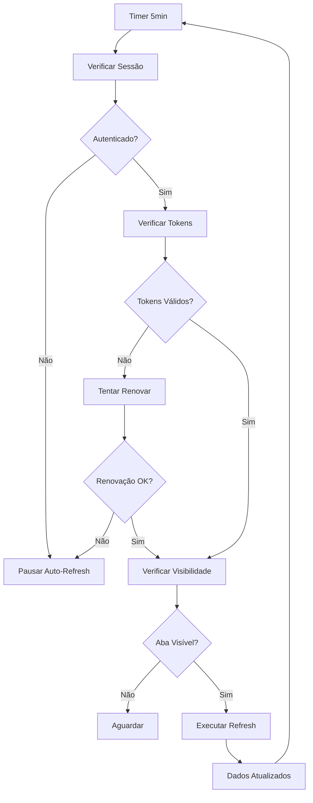

# Sistema de Auto-Refresh para Páginas de Listagem - Implementação Completa

## 🎯 Objetivo Principal

Implementar um sistema centralizado e inteligente de auto-refresh para todas as páginas de listagem da aplicação, com detecção automática de expiração de sessão e otimizações de performance.

## 📋 Resumo da Solução

### **Problema Inicial**
- Dados desatualizados nas páginas de listagem
- Usuários precisavam recarregar manualmente para ver novos pedidos
- Não havia sincronização automática entre diferentes sessões
- Experiência de usuário inconsistente entre diferentes tipos de listagem

### **Solução Implementada**
- **Custom Hook reutilizável** para auto-refresh centralizado
- **Detecção inteligente de sessão** com pausa automática quando tokens expiram
- **Otimizações de performance** com detecção de visibilidade da aba
- **Aplicação consistente** em todas as 7 páginas de listagem
- **Preservação de filtros** durante refresh automático

---

## 🏗️ Arquitetura da Solução

### **1. Custom Hook - useAutoRefresh**
```javascript
// Localização: 00_frontend/src/hooks/useAutoRefresh.js
- useAutoRefresh(refreshCallback, intervalMs, enabled) - Hook principal
- Detecção automática de sessão expirada
- Pausa durante inatividade da aba
- Refresh imediato quando usuário retorna
- Cleanup automático de timers e listeners
```

### **2. Sistema de Detecção de Sessão**
```javascript
// Integração com TokenManager existente
- tokenManager.isAuthenticated() - Verifica se user está autenticado
- tokenManager.ensureValidTokenForOperation() - Tenta renovar tokens
- Pausa automática quando refresh token expira
- Logs informativos para debugging
```

### **3. Páginas Implementadas**
```javascript
// Todas as 7 páginas de listagem foram atualizadas:
- /admin/orderslist - Lista de pedidos (Admin)
- /admin/budgetsforapproval - Orçamentos para aprovação (Admin)  
- /admin/productionorders - Pedidos de produção (Admin)
- /forge/orderslist - Lista de pedidos (Forge)
- /forge/budgetsforapproval - Orçamentos para aprovação (Forge)
- /forge/productionorders - Pedidos de produção (Forge)
- /agent/myorders - Meus pedidos (Agent)
```

---

## 🔧 Implementação Detalhada

### **1. Custom Hook useAutoRefresh**

#### **Estrutura Principal**
```javascript
export default function useAutoRefresh(refreshCallback, intervalMs = 5 * 60 * 1000, enabled = true) {
    const savedCallback = useRef(refreshCallback);
    
    // Update callback reference without triggering re-renders
    useEffect(() => {
        savedCallback.current = refreshCallback;
    }, [refreshCallback]);
    
    // Main auto-refresh logic with session validation
    const performAutoRefresh = useCallback(async () => {
        // Session validation before any API call
        // Performance optimization with tab visibility
        // Error handling and logging
    }, [enabled]);
}
```

#### **Detecção de Sessão**
```javascript
// Verifica se usuário está autenticado
if (!tokenManager.isAuthenticated()) {
    console.log('🔄 Auto-refresh paused: User not authenticated');
    return;
}

// Tenta renovar tokens se necessário (30s buffer)
const canPerformOperation = await tokenManager.ensureValidTokenForOperation(30);

if (!canPerformOperation) {
    console.log('🔄 Auto-refresh paused: Session expired (refresh token invalid)');
    return;
}
```

#### **Otimizações de Performance**
```javascript
// Só executa refresh se aba está visível
if (!document.hidden && savedCallback.current) {
    await savedCallback.current();
}

// Refresh imediato quando usuário retorna à aba
const handleVisibilityChange = useCallback(() => {
    if (!document.hidden && enabled) {
        performAutoRefresh();
    }
}, [enabled, performAutoRefresh]);
```

### **2. Implementação nas Páginas**

#### **Padrão de Implementação**
```javascript
// 1. Import do hook
import useAutoRefresh from '@/hooks/useAutoRefresh';

// 2. Extração da função de fetch
const fetchBudgetsOrders = useCallback(async (resetFilters = true) => {
    // Preserva filtros durante auto-refresh
    if (!resetFilters) {
        // Não altera searchTerm, sortOrder, currentPage
    } else {
        // Reset completo (mount inicial ou mudança de idioma)
        setSearchTerm('');
        setSortOrder('newest');
        setCurrentPage(1);
    }
    
    // Chamada à API específica da página
    const response = await axiosInstance.get('/api/endpoint');
    // Processamento dos dados
}, []);

// 3. Callback para auto-refresh
const autoRefreshCallback = useCallback(async () => {
    await fetchBudgetsOrders(false); // Preserva filtros
}, [fetchBudgetsOrders]);

// 4. Ativação do auto-refresh
useAutoRefresh(autoRefreshCallback, 5 * 60 * 1000, true);
```

#### **Endpoints por Página**
```javascript
// Admin
/admin/orderslist -> '/api/get-orders-list'
/admin/budgetsforapproval -> '/api/get-approval-orders-list'
/admin/productionorders -> '/api/get-prod-orders-list'

// Forge
/forge/orderslist -> '/api/get-orders-list'
/forge/budgetsforapproval -> '/api/get-approval-orders-list'
/forge/productionorders -> '/api/get-prod-orders-list'

// Agent
/agent/myorders -> '/api/get-my-orders'
```

---

## ⚡ Funcionamento do Sistema

### **1. Fluxo Normal de Auto-Refresh**


### **2. Estados do Sistema**
```javascript
// Estados possíveis do auto-refresh
ACTIVE: "Auto-refresh ativo, chamando API a cada 5min"
PAUSED_HIDDEN: "Pausado - aba não visível"
PAUSED_UNAUTHENTICATED: "Pausado - usuário não autenticado"
PAUSED_SESSION_EXPIRED: "Pausado - sessão expirada (refresh token inválido)"
DISABLED: "Desabilitado manualmente"
```

### **3. Comportamento por Cenário**

#### **Usuário Ativo**
- ✅ Auto-refresh a cada 5 minutos
- ✅ Tokens renovados automaticamente quando necessário
- ✅ Dados sempre atualizados
- ✅ Filtros preservados

#### **Usuário Inativo (aba em background)**
- ⏸️ Auto-refresh pausado (performance)
- ✅ Refresh imediato quando retorna à aba
- ✅ Sessão mantida se dentro do prazo

#### **Sessão Expirada**
- ❌ Auto-refresh pausado permanentemente
- ❌ Não tenta renovar tokens desnecessariamente
- ℹ️ Logs informativos para debugging

---

## 🎯 Vantagens da Implementação

### **1. Centralização e Reusabilidade**
- **Hook único** para todas as páginas de listagem
- **Manutenção simples** - mudanças em um local
- **Comportamento consistente** em toda a aplicação

### **2. Otimização de Performance**
- **Pausa automática** quando aba não está visível
- **Refresh inteligente** quando usuário retorna
- **Cleanup automático** de timers e listeners

### **3. Gestão Inteligente de Sessão**
- **Detecção automática** de sessão expirada
- **Prevenção de chamadas desnecessárias** à API
- **Não interferência** com sistema de renovação de tokens

### **4. Experiência do Usuário**
- **Dados sempre atualizados** sem intervenção manual
- **Filtros preservados** durante auto-refresh
- **Funcionamento transparente** - sem feedback visual necessário

---

## 🧪 Como Testar o Sistema

### **1. Teste de Funcionamento Básico**
```javascript
// 1. Abrir qualquer página de listagem
// 2. Aguardar 5 minutos
// 3. Verificar se dados são atualizados automaticamente
// 4. Confirmar que filtros são preservados
```

### **2. Teste de Visibilidade de Aba**
```javascript
// 1. Abrir página de listagem
// 2. Mudar para outra aba do browser
// 3. Aguardar 5+ minutos
// 4. Retornar à aba da aplicação
// 5. Verificar refresh imediato dos dados
```

### **3. Teste de Sessão Expirada**
```javascript
// 1. Abrir página de listagem
// 2. Aguardar refresh token expirar (7 dias)
// 3. Verificar que auto-refresh para automaticamente
// 4. Confirmar logs no console: "Session expired"
```

### **4. Verificação de Logs**
```javascript
// Abrir DevTools > Console
// Logs esperados:
"🔄 Auto-refresh executing for [page]"
"🔄 Auto-refresh paused: User not authenticated"
"🔄 Auto-refresh paused: Session expired (refresh token invalid)"
```

---

## 🔧 Manutenção e Configuração

### **1. Alterar Intervalo de Refresh**
```javascript
// Em cada página, modificar o valor:
useAutoRefresh(autoRefreshCallback, 5 * 60 * 1000, true);
//                                 ↑ 5 minutos em ms

// Para 3 minutos:
useAutoRefresh(autoRefreshCallback, 3 * 60 * 1000, true);
```

### **2. Desabilitar Auto-Refresh**
```javascript
// Desabilitar para página específica:
useAutoRefresh(autoRefreshCallback, 5 * 60 * 1000, false);
//                                                  ↑ disabled

// Desabilitar globalmente:
// Remover/comentar linha useAutoRefresh() da página
```

### **3. Modificar Buffer de Renovação**
```javascript
// No hook useAutoRefresh.js, linha ~35:
const canPerformOperation = await tokenManager.ensureValidTokenForOperation(30);
//                                                                          ↑ 30s buffer

// Para 60 segundos:
const canPerformOperation = await tokenManager.ensureValidTokenForOperation(60);
```

### **4. Adicionar Auto-Refresh a Nova Página**
```javascript
// 1. Importar o hook
import useAutoRefresh from '@/hooks/useAutoRefresh';

// 2. Criar função de fetch reutilizável
const fetchData = useCallback(async (resetFilters = true) => {
    // Sua lógica de fetch aqui
}, []);

// 3. Criar callback para auto-refresh
const autoRefreshCallback = useCallback(async () => {
    await fetchData(false); // Preserva filtros
}, [fetchData]);

// 4. Ativar auto-refresh
useAutoRefresh(autoRefreshCallback, 5 * 60 * 1000, true);
```

---

## 🚨 Problemas Conhecidos e Limitações

### **1. Dependência do TokenManager**
- **Problema**: Sistema depende do TokenManager existente
- **Solução**: Manter TokenManager atualizado e funcional
- **Impacto**: Auto-refresh pode parar se TokenManager falhar

### **2. Logs Apenas no Console**
- **Problema**: Não há interface visual para status do auto-refresh
- **Solução**: Verificar logs no DevTools para debugging
- **Impacto**: Usuários não sabem quando auto-refresh está pausado

### **3. Filtros Específicos**
- **Problema**: Algumas páginas podem ter filtros únicos não contemplados
- **Solução**: Testar individualmente cada página após modificações
- **Impacto**: Perda de filtros específicos durante auto-refresh

### **4. Performance em Muitas Abas**
- **Problema**: Múltiplas abas abertas = múltiplos timers
- **Solução**: Browser pausa timers em abas inativas automaticamente
- **Impacto**: Consumo de memória ligeiramente maior

---

## 📝 Notas Técnicas

### **1. Integração com Axios Interceptors**
O sistema funciona perfeitamente com os interceptors existentes:
- Auto-refresh → API call → Interceptor detecta token expirado → Renova automaticamente
- Se renovação falhar → Interceptor redireciona para login
- Auto-refresh detecta no próximo ciclo e pausa

### **2. Cleanup de Recursos**
```javascript
// O hook limpa automaticamente:
- clearInterval(intervalId) - Remove timer
- removeEventListener('visibilitychange') - Remove listener
- Executado quando componente desmonta
```

### **3. Refs vs State**
```javascript
// Uso de useRef para callback evita re-renders desnecessários
const savedCallback = useRef(refreshCallback);

// Atualização sem triggerar useEffect
savedCallback.current = refreshCallback;
```

### **4. Memoização de Callbacks**
```javascript
// useCallback previne re-criação desnecessária de funções
const autoRefreshCallback = useCallback(async () => {
    await fetchBudgetsOrders(false);
}, [fetchBudgetsOrders]);
```

---

## 🎯 Próximos Passos Possíveis

### **1. Interface Visual (Opcional)**
- Indicador de "última atualização" 
- Icon de sincronização durante refresh
- Notificação quando sessão expira

### **2. Configuração Dinâmica**
- Painel admin para configurar intervalos
- Diferentes intervalos por tipo de página
- Ativação/desativação por usuário

### **3. Métricas e Monitoramento**
- Contagem de auto-refreshes executados
- Tempo médio de resposta das APIs
- Estatísticas de renovação de tokens

### **4. Refresh Inteligente**
- Detectar se houve mudanças reais nos dados
- Refresh apenas quando necessário
- Integração com WebSockets para updates em tempo real

---

## 📚 Referências e Dependências

### **Dependências Externas**
- React Hooks (useState, useEffect, useCallback, useRef)
- TokenManager (/lib/tokenManager.js)
- Axios Instance (/lib/axiosInstance.js)

### **Arquivos Relacionados**
- `00_frontend/src/hooks/useAutoRefresh.js` - Hook principal
- `00_frontend/src/lib/tokenManager.js` - Gestão de tokens
- `00_frontend/src/lib/axiosInstance.js` - Configuração Axios
- Todas as páginas de listagem mencionadas

### **Documentação Relacionada**
- `explicação_tokens.md` - Sistema de autenticação
- `jwt_refresh_implementation.md` - Implementação JWT
- `sistema_mudancas_nao_salvas.md` - Context API patterns

---

**Implementado por: Thúlio Silva**  
**Versão: 1.0**  
**Status: Produção - Funcionando em todas as páginas de listagem** 