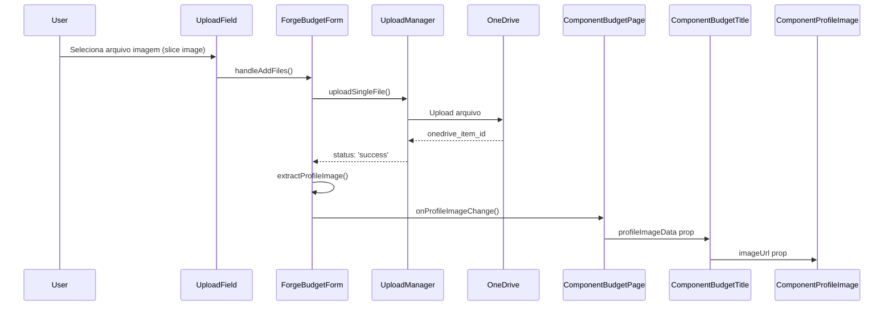
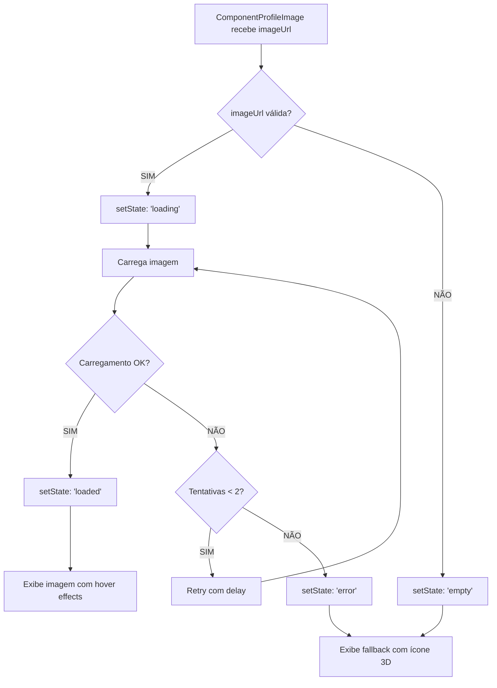

# Sistema de Foto de Perfil do Componente 3D

**Documentação criada em:** 22 de Janeiro de 2025  
**Autor:** Thúlio Silva

## 🎯 Objetivo Principal

Implementar um sistema completo de foto de perfil para componentes 3D que extrai automaticamente a primeira imagem do slice (sliceImage) enviada pelo usuário no ForgeBudgetForm e a exibe como imagem de perfil circular no ComponentBudgetTitle.

## 📋 Resumo da Solução

### **Funcionalidades Implementadas**
- **ComponentProfileImage**: Componente reutilizável para exibir fotos de perfil circulares
- **Extração Automática**: Sistema que identifica a primeira sliceImage nos arquivos uploadados
- **Comunicação Reativa**: Fluxo de dados entre componentes para atualização em tempo real
- **Fallback Inteligente**: Exibe ícone 3D e iniciais quando não há imagem disponível
- **Logs Detalhados**: Sistema completo de logging para debugging

### **Fluxo de Dados Implementado**
```
UploadField → ForgeBudgetForm → ComponentBudgetPage → ComponentBudgetTitle → ComponentProfileImage
```

---

## 🏗️ Arquitetura da Solução

### **1. ComponentProfileImage.js - Componente Base**

**Localização**: `00_frontend/src/components/ui/ComponentProfileImage.js`

#### **Funcionalidades Principais**
- Display circular responsivo com múltiplos tamanhos (small, medium, large)
- Sistema de fallback com ícone 3D e iniciais do componente
- Loading state com skeleton animation
- Error handling com retry automático (até 2 tentativas)
- Lazy loading otimizado para performance
- Logs detalhados para debugging

#### **Props Interface**
```javascript
{
  imageUrl: string|null,           // URL da imagem ou null
  size: 'small'|'medium'|'large',  // Tamanho do componente
  alt: string,                     // Texto alternativo para acessibilidade
  componentTitle: string,          // Título do componente para fallback
  showBorder: boolean,             // Mostrar borda ao redor da imagem
  onImageLoad: function,           // Callback para imagem carregada
  onImageError: function,          // Callback para erro de carregamento
  enableLogs: boolean              // Habilitar logs detalhados
}
```

#### **Estados Gerenciados**
```javascript
const [imageState, setImageState] = useState('loading'); // 'loading', 'loaded', 'error', 'empty'
const [displayUrl, setDisplayUrl] = useState(null);
const [retryCount, setRetryCount] = useState(0);
```

### **2. Extração Automática de SliceImage**

**Localização**: `ForgeBudgetForm.js`

#### **Função `extractProfileImage()`**
```javascript
const extractProfileImage = (files) => {
  // Filtra arquivos para encontrar sliceImage files que foram uploadados com sucesso
  const sliceImages = files.filter(file => {
    const isSliceImage = file.budgetCategory === 'sliceImage';
    const isUploaded = file.status === 'success' && file.onedrive_item_id;
    return isSliceImage && isUploaded;
  });
  
  // Retorna o primeiro sliceImage disponível
  return sliceImages.length > 0 ? {
    fileName: sliceImages[0].name,
    oneDriveItemId: sliceImages[0].onedrive_item_id,
    tempId: sliceImages[0].tempId,
    budgetCategory: sliceImages[0].budgetCategory,
    status: sliceImages[0].status
  } : null;
};
```

#### **Monitoramento Reativo**
```javascript
useEffect(() => {
  const currentProfileImage = extractProfileImage(uploadedFiles);
  onProfileImageChange(currentProfileImage);
}, [uploadedFiles, onProfileImageChange]);
```

### **3. Comunicação Entre Componentes**

#### **ForgeBudgetForm → ComponentBudgetPage**
```javascript
// ForgeBudgetForm.js - Prop callback
onProfileImageChange // New prop: callback for profile image changes

// ComponentBudgetPage.js - Handler
const handleProfileImageChange = (profileImage) => {
  setProfileImageData(profileImage);
};
```

#### **ComponentBudgetPage → ComponentBudgetTitle**
```javascript
// ComponentBudgetPage.js - Passing data
<ComponentBudgetTitle
  profileImageData={profileImageData}
  // ... other props
/>
```

#### **ComponentBudgetTitle → ComponentProfileImage**
```javascript
// ComponentBudgetTitle.js - Integration
<ComponentProfileImage
  imageUrl={getProfileImageUrl(profileImageData)}
  size="medium"
  alt={`Imagem de perfil - ${componentData.title}`}
  componentTitle={componentData.title}
  showBorder={true}
  enableLogs={true}
/>
```

### **4. Geração de URL da Imagem**

**Localização**: `ComponentBudgetTitle.js`

#### **Função `getProfileImageUrl()`**
```javascript
const getProfileImageUrl = (profileImageData) => {
  if (!profileImageData || !profileImageData.oneDriveItemId) {
    return null;
  }
  
  // Para uploads de budget, usa o endpoint de download temporário
  const imageUrl = `/api/get-download-link/${profileImageData.oneDriveItemId}`;
  return imageUrl;
};
```

---

## 🎨 Design e Layout

### **Posicionamento na UI**
- **Localização**: ComponentBudgetTitle, ao lado esquerdo do título do componente
- **Layout**: Flexbox horizontal com gap de 16px
- **Responsividade**: Tamanho medium (16x16 → 20x20 em md+)

### **Estados Visuais**

#### **1. Estado Loading (Carregando)**
```jsx
<div className="animate-pulse bg-gradient-to-br from-gray-100 to-gray-200 rounded-full">
  <div className="bg-gray-300 animate-pulse rounded-full"></div>
</div>
```

#### **2. Estado Loaded (Imagem Carregada)**
```jsx

```

#### **3. Estado Fallback (Sem Imagem)**
```jsx
<div className="bg-gradient-to-br from-gray-50 to-gray-100 hover:from-blue-50 hover:to-blue-100">
  {/* Ícone 3D SVG */}
  <svg className="text-gray-400 group-hover:text-[#004587]">...</svg>
  {/* Iniciais do componente */}
  <span className="font-semibold text-gray-500">{getInitials(componentTitle)}</span>
</div>
```

### **Animações e Transições**
- **Hover effects**: Scale transform (1.05x), brightness increase
- **Color transitions**: 300ms duration para mudanças de cor
- **Loading skeleton**: Pulse animation contínua
- **Border feedback**: Cor azul quando imagem está presente

---

## 📊 Sistema de Logging Detalhado

### **Logs por Componente**

#### **ComponentProfileImage.js**
```javascript
🖼️ [ComponentProfileImage] Inicializando ComponentProfileImage com configurações
🖼️ [ComponentProfileImage] URL de imagem válida detectada
🖼️ [ComponentProfileImage] ✅ Imagem carregada com sucesso
🖼️ [ComponentProfileImage] ❌ Falha ao carregar imagem (tentativa X/3)
🖼️ [ComponentProfileImage] Estado da imagem alterado para: {imageState}
```

#### **ForgeBudgetForm.js**
```javascript
🖼️ [ForgeBudgetForm] Monitoring files for profile image changes: {count}
🖼️ [ForgeBudgetForm] Checking file for profile image: {fileDetails}
🖼️ [ForgeBudgetForm] Profile image selected: {profileImageDetails}
🖼️ [ForgeBudgetForm] Notifying parent about profile image change
```

#### **ComponentBudgetPage.js**
```javascript
🖼️ [ComponentBudgetPage] Received profile image update: {updateDetails}
🖼️ [ComponentBudgetPage] Clearing profile image data due to form reset
```

#### **ComponentBudgetTitle.js**
```javascript
🖼️ [ComponentBudgetTitle] Profile image data changed: {changeDetails}
🖼️ [ComponentBudgetTitle] Generated profile image URL: {urlDetails}
🖼️ [ComponentBudgetTitle] Profile image loaded successfully
🖼️ [ComponentBudgetTitle] Profile image failed to load
```

---

## 🔄 Fluxo de Funcionamento

### **1. Upload de Imagem**


### **2. Exibição da Imagem**


### **3. Atualização Reativa**
- **Adição de arquivo**: Automaticamente detecta nova sliceImage e atualiza a imagem de perfil
- **Remoção de arquivo**: Remove a imagem de perfil se era a única sliceImage
- **Reset do formulário**: Limpa a imagem de perfil junto com outros dados

---

## 🎯 Categorização de Arquivos

### **SliceImage Extensions**
```javascript
const sliceImageExtensions = ['jpg', 'jpeg', 'png', 'gif', 'webp', 'bmp', 'tiff', 'tif'];
```

### **Validação no UploadField**
```javascript
if (for_budget) {
  const category = categorizeFileForBudget(file.name);
  if (category !== 'slice' && category !== 'sliceImage') {
    // Reject file
  }
  file.budgetCategory = category; // Mark for later filtering
}
```

### **Filtro para Profile Image**
```javascript
const sliceImages = files.filter(file => {
  const isSliceImage = file.budgetCategory === 'sliceImage';
  const isUploaded = file.status === 'success' && file.onedrive_item_id;
  return isSliceImage && isUploaded;
});
```

---

## 🚀 Funcionalidades Implementadas

### **✅ Componente Reutilizável**
- ComponentProfileImage com props configuráveis
- Suporte a múltiplos tamanhos e estilos
- Interface consistente com outros componentes do sistema

### **✅ Detecção Automática de Imagem**
- Extração da primeira sliceImage dos arquivos uploadados
- Validação de status de upload antes de usar como perfil
- Tratamento de casos edge (sem imagem, erro de upload, etc.)

### **✅ Comunicação Reativa**
- Sistema de callbacks para comunicação entre componentes
- Estado gerenciado no ComponentBudgetPage como single source of truth
- Propagação de mudanças em tempo real

### **✅ UX Otimizada**
- Loading states com skeleton animation
- Fallback visual atrativo com ícone 3D
- Hover effects e transições suaves
- Retry automático para falhas de carregamento

### **✅ Performance**
- Lazy loading de imagens
- Estados otimizados para evitar re-renders desnecessários
- Cleanup automático em componentes desmontados

### **✅ Debugging e Manutenção**
- Logs detalhados em todos os componentes
- Informações contextuais para troubleshooting
- Estados claramente identificáveis

---

## 📁 Arquivos Modificados/Criados

### **Arquivos Criados**
```
00_frontend/src/components/ui/ComponentProfileImage.js                    (265 linhas)
files/codedocs/frontend/sistema_foto_perfil_componente.md                (Este arquivo)
```

### **Arquivos Modificados**
```
00_frontend/src/components/forms/budgetforms/ForgeBudgetForm.js
├── Adicionada prop onProfileImageChange
├── Implementada função extractProfileImage()
├── Adicionado useEffect para monitoramento de arquivos
├── Logs detalhados para profile image

00_frontend/src/app/component/[basecomponentId]/[version]/budget/page.js
├── Adicionado estado profileImageData
├── Implementado callback handleProfileImageChange()
├── Passagem de props para ComponentBudgetTitle
├── Limpeza de estado no reset

00_frontend/src/components/forms/budgetforms/ComponentBudgetTitle.js
├── Import do ComponentProfileImage
├── Adicionada prop profileImageData
├── Implementada função getProfileImageUrl()
├── Integração do ComponentProfileImage no layout
├── Skeleton atualizado com profile image
├── Logs detalhados para debugging
```

---

## 🔍 Pontos de Atenção

### **1. Dependência do UploadManager**
- A funcionalidade depende do sistema de uploadManager já implementado
- Requer que arquivos tenham `budgetCategory` corretamente definida
- Necessita que `status: 'success'` e `onedrive_item_id` estejam presentes

### **2. API de Download**
- Usa endpoint `/api/get-download-link/[oneDriveItemId]` para acessar imagens
- Endpoint deve estar configurado para retornar imagens com headers apropriados
- Possível necessidade de autenticação/autorização

### **3. Tipos de Arquivo Suportados**
- Apenas extensões definidas em `sliceImageExtensions` são aceitas
- Sistema pode ser estendido para suportar outros formatos de imagem
- Validação de MIME type pode ser adicionada para maior segurança

### **4. Performance**
- Imagens são carregadas sob demanda (lazy loading)
- Sistema de retry pode gerar múltiplas requisições em caso de falha
- Cache de imagens fica a cargo do browser

---

## 🎯 Benefícios Conquistados

### **Para Desenvolvedores**
- 📚 **Componente reutilizável**: ComponentProfileImage pode ser usado em outros contextos
- 🔧 **Arquitetura limpa**: Separação clara de responsabilidades entre componentes
- 🐛 **Debugging facilitado**: Logs detalhados em toda a cadeia de comunicação
- 🔄 **Manutenibilidade**: Código bem estruturado e documentado

### **Para Usuários**
- 🖼️ **Visualização intuitiva**: Imagem de perfil circular para cada componente
- ⚡ **Feedback imediato**: Atualização em tempo real ao fazer upload
- 🎨 **UX consistente**: Design integrado com o restante da aplicação
- 🔄 **Estados claros**: Loading, erro e fallback bem definidos

### **Para o Sistema**
- 🔒 **Integração robusta**: Funciona com o sistema de uploads existente
- 📊 **Monitoramento**: Logs detalhados para troubleshooting
- 🚀 **Escalabilidade**: Arquitetura permite extensões futuras
- 💾 **Performance**: Otimizado para carregamento eficiente

---

## 🔮 Conclusão

O sistema de foto de perfil do componente 3D foi implementado com sucesso, proporcionando:

- **Funcionalidade completa** de exibição de imagem de perfil circular
- **Integração perfeita** com o sistema de uploads existente
- **UX otimizada** com estados visuais claros e animações suaves
- **Arquitetura escalável** e código limpo e bem documentado

O sistema funciona de forma reativa, atualizando automaticamente a imagem de perfil sempre que o usuário faz upload de uma nova sliceImage, proporcionando uma experiência fluida e intuitiva para visualização de componentes 3D.

---

**Status**: ✅ **COMPLETAMENTE IMPLEMENTADO**  
**Impacto**: 🎨 **UX ENHANCEMENT - VISUALIZAÇÃO DE COMPONENTES**  
**Complexidade**: 🔧 **MÉDIA - INTEGRAÇÃO MULTI-COMPONENTE**  
**Documentação**: 📚 **COMPLETA COM LOGS DETALHADOS**