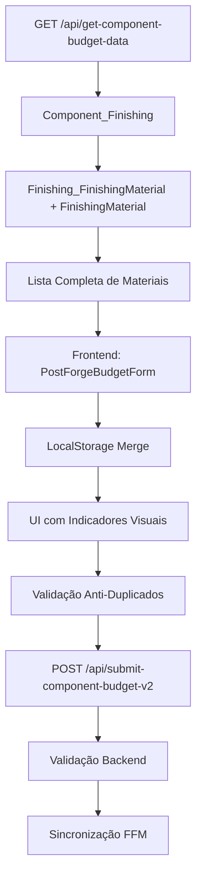

# Sistema de Materiais e Acabamentos: Implementação Completa com Catálogo Estático e Prevenção de Duplicados v3

Autor: Thúlio Silva

---

## 🎯 Objetivo

Documentar de forma abrangente a implementação completa do sistema de materiais e acabamentos para Post-Forge, incluindo:
- Migração de listagem dinâmica (baseada em orçamentos anteriores) para catálogo estático
- Sistema de prevenção de duplicados robusto (frontend + backend)
- Sincronização automática de associações Finishing_FinishingMaterial
- Gestão inteligente de localStorage com regras específicas por tipo de material
- Indicadores visuais de tipo de material (Catálogo/Novo/Adicionado)

---

## 🧭 Contexto e Problema Inicial

### Problema Principal
O sistema anterior construía a lista de materiais por acabamento baseando-se no último orçamento salvo (ComponentBudgetFinishingMaterial), causando:
- **"Sumiço" de materiais**: materiais desabilitados (isEnabled=false) não apareciam na lista após refresh
- **Inconsistência de catálogo**: materiais elegíveis não eram persistidos estaticamente
- **Duplicação descontrolada**: usuários podiam adicionar o mesmo material múltiplas vezes
- **Falta de rastreabilidade**: não havia distinção visual entre tipos de material

### Arquitetura Anterior vs Nova

**Antes:**
```
GET → ComponentBudgetFinishingMaterial (último orçamento) → Lista de materiais
```

**Depois:**
```
GET → Finishing_FinishingMaterial + FinishingMaterial (catálogo estático) → Lista completa
```

---

## 🏗️ Arquitetura da Solução

### Fluxo de Dados Completo



### Tabelas Principais

1. **Finishing_FinishingMaterial** (Catálogo Estático)
   - Associações permanentes entre acabamentos e materiais elegíveis
   - Fonte única de verdade para listagem

2. **ComponentBudgetFinishingMaterial** (Uso Dinâmico)
   - Materiais efetivamente usados em cada orçamento
   - Snapshots de valores no momento da submissão

3. **Component_FinishingMaterialOverride** (Preferências por Componente)
   - Materiais desabilitados especificamente para um componente
   - Não remove do catálogo, apenas marca como não preferido

---

## 🔧 Implementação Backend

### API GET: get-component-budget-data.js

#### Mudanças Principais
```javascript
// ANTES: Baseado no último orçamento
const savedMap = await getSavedFinishingsWithMaterials(client_pg, latestBudgetId);

// DEPOIS: Baseado no catálogo estático
const eligQuery = `
  SELECT ffm.finishing_id, fm.id AS material_id, fm.name, fm.brand_name,
         fm.default_unit_cost, fm.currency, fm.unit_of_measurement, 
         fm.purchase_link, fm.description
  FROM "Finishing_FinishingMaterial" ffm
  JOIN "FinishingMaterial" fm ON fm.id = ffm.finishing_material_id
  WHERE ffm.finishing_id = ANY($1::uuid[]) AND fm.is_active = true
  ORDER BY ffm.finishing_id, LOWER(fm.name)
`;
```

#### Estrutura de Resposta
```javascript
responseData.finishings = {
  catalog: simpleCatalog,
  component: enrichedComponentFinishings // com materials do catálogo
};
```

### API POST: submit-component-budget-v2.js

#### Sistema de Prevenção de Duplicados
```javascript
// Por finishing, manter controle de duplicados
const usedById = new Set();           // finishing_material_id únicos
const usedByKB = new Set();          // pares (name, brand) únicos

// Validação por ID
if (hasValidUuid) {
  if (usedById.has(finishing_material_id)) {
    return res.status(400).json({ 
      success: false, 
      errors: [{ message: 'Material duplicado neste acabamento (id repetido)' }] 
    });
  }
  usedById.add(finishing_material_id);
}

// Validação por nome+marca (case-insensitive)
const kb = `${material_name_input.toLowerCase().trim()}|${(brand_name_snapshot || '').toLowerCase().trim()}`;
if (usedByKB.has(kb)) {
  return res.status(400).json({ 
    success: false, 
    errors: [{ message: 'Material duplicado neste acabamento (nome+marca repetidos)' }] 
  });
}
usedByKB.add(kb);
```

#### Sincronização Automática de FFM
```javascript
// Carregar associações existentes
const existingFFMRes = await clientPg.query(
  'SELECT finishing_material_id FROM "Finishing_FinishingMaterial" WHERE finishing_id = $1',
  [finishing_id]
);
const existingFFM = new Set(existingFFMRes.rows.map(r => r.finishing_material_id));
const desiredFFM = new Set();

// Durante processamento: adicionar ao desiredFFM
await clientPg.query(`
  INSERT INTO "Finishing_FinishingMaterial"(finishing_id, finishing_material_id, is_required)
  VALUES ($1, $2, TRUE) ON CONFLICT (finishing_id, finishing_material_id) DO NOTHING
`, [finishing_id, finishing_material_id]);
desiredFFM.add(finishing_material_id);

// Ao final: remover associações não presentes
const toRemove = [];
for (const matId of existingFFM) {
  if (!desiredFFM.has(matId)) toRemove.push(matId);
}
if (toRemove.length > 0) {
  await clientPg.query(`
    DELETE FROM "Finishing_FinishingMaterial"
    WHERE finishing_id = $1 AND finishing_material_id = ANY($2::uuid[])
  `, [finishing_id, toRemove]);
}
```

---

## 🎨 Implementação Frontend

### PostForgeBudgetForm.js

#### Sistema de Merge Inteligente
```javascript
const mergePostForgeFinishings = (initialList = [], savedFinishings = []) => {
  // Para materiais do catálogo: apenas campos dinâmicos e toggle do localStorage
  return {
    ...bm, // dados do catálogo (estáticos)
    isEnabled: sm?.isEnabled === false ? false : true,
    unitConsumption: sm?.unitConsumption || 0,
    applicationHours: sm?.applicationHours || 0,
    // Campos estáticos sempre do catálogo (bm), ignorando edições locais
    name: bm.name,
    supplierName: bm.supplierName,
    unitCost: bm.unitCost,
    // ...
  };
};
```

#### Validação Anti-Duplicados
```javascript
const checkDuplicateMaterial = (finishingId, materialIndex, field, value, currentMaterials) => {
  const updatedMaterial = { ...currentMaterial, [field]: value };
  
  for (let i = 0; i < currentMaterials.length; i++) {
    if (i === materialIndex) continue;
    const otherMaterial = currentMaterials[i];
    
    // Check 1: Same finishingMaterialId
    if (updatedMaterial.finishingMaterialId && otherMaterial.finishingMaterialId &&
        updatedMaterial.finishingMaterialId === otherMaterial.finishingMaterialId) {
      return 'Este material já está associado a este acabamento.';
    }
    
    // Check 2: Same normalized (name, supplierName)
    const updatedName = normalizeText(updatedMaterial.name);
    const updatedBrand = normalizeText(updatedMaterial.supplierName);
    const otherName = normalizeText(otherMaterial.name);
    const otherBrand = normalizeText(otherMaterial.supplierName);
    
    if (updatedName && updatedName === otherName && updatedBrand === otherBrand) {
      return 'Já existe um material com o mesmo nome e marca neste acabamento.';
    }
  }
  return null;
};
```

### PostForgeMaterialForm.js

#### Prevenção na Seleção de Materiais
```javascript
const applyMaterialSelection = (m) => {
  const selectedId = m?.id;
  const selectedName = normalizeText(m?.name);
  const selectedBrand = normalizeText(m?.brand_name);
  
  const currentMaterials = finishing?.materials || [];
  const dupById = selectedId && currentMaterials.some(x => 
    x.finishingMaterialId && x.finishingMaterialId === selectedId
  );
  const dupByKB = currentMaterials.some(x => 
    normalizeText(x.name) === selectedName && 
    normalizeText(x.supplierName) === selectedBrand
  );
  
  if (dupById || dupByKB) {
    toast.error('Este material já está presente neste acabamento.');
    return; // Não aplica a seleção
  }
  
  // Continua com aplicação...
};
```

### PostForgeMaterialAccordion.js

#### Indicadores Visuais de Tipo
```javascript
// Lógica de determinação do tipo
const hasFinishingMaterialId = material.finishingMaterialId && !material.id?.startsWith('temp_');
const isNewLocal = material.id?.startsWith('temp_') && !material.finishingMaterialId;
const isExistingNotAssociated = material.finishingMaterialId && material.id?.startsWith('temp_');

// Renderização das pílulas
if (hasFinishingMaterialId) {
  return <span className="px-2 py-1 rounded-full text-xs font-medium bg-blue-100 text-blue-800 border border-blue-200">Catálogo</span>;
} else if (isExistingNotAssociated) {
  return <span className="px-2 py-1 rounded-full text-xs font-medium bg-emerald-100 text-emerald-800 border border-emerald-200">Adicionado</span>;
} else if (isNewLocal) {
  return <span className="px-2 py-1 rounded-full text-xs font-medium bg-amber-100 text-amber-800 border border-amber-200">Novo</span>;
}
```

---

## 📋 Regras de Negócio Implementadas

### 1. Tipos de Material e Comportamento

| Tipo | Identificação | Comportamento localStorage | Indicador Visual |
|------|---------------|---------------------------|------------------|
| **Catálogo** | `finishingMaterialId` presente, sem `temp_` | Apenas campos dinâmicos persistem | Pílula azul "Catálogo" |
| **Novo** | `id` com `temp_`, sem `finishingMaterialId` | Todos os campos persistem | Pílula âmbar "Novo" |
| **Adicionado** | `finishingMaterialId` + `id` com `temp_` | Todos os campos persistem | Pílula verde "Adicionado" |

### 2. Prevenção de Duplicados

#### Frontend (UX Imediata)
- Validação em `handleMaterialChange` antes de aplicar alterações
- Validação em `applyMaterialSelection` antes de selecionar da lista
- Normalização: `toLowerCase()` + `normalize('NFD')` + remoção de diacríticos

#### Backend (Fonte de Verdade)
- Validação por `finishing_material_id` único por acabamento
- Validação por par `(name, brand_name)` case-insensitive por acabamento
- Retorno HTTP 400 com mensagem específica

### 3. Sincronização de Associações

#### Inserção Automática
```sql
INSERT INTO "Finishing_FinishingMaterial"(finishing_id, finishing_material_id, is_required)
VALUES ($1, $2, TRUE)
ON CONFLICT (finishing_id, finishing_material_id) DO NOTHING
```

#### Remoção Automática
- Materiais removidos do formulário têm suas associações FFM deletadas
- Apenas para materiais que vieram do catálogo (tinham `finishingMaterialId`)
- Preserva integridade: outros acabamentos não são afetados

---

## 🧪 Casos de Teste Implementados

### 1. Prevenção de Duplicados por ID
**Cenário:** Acabamento com material A do GET, usuário tenta adicionar A novamente
**Resultado:** Toast de erro, material não é aplicado

### 2. Prevenção por Nome+Marca (Case-Insensitive)
**Cenário:** Material "Álcool XPTO" existe, usuário cria "alcool xpto"
**Resultado:** Toast de erro ao completar a duplicidade

### 3. Remoção de Associação FFM
**Cenário:** Material A do GET é removido e orçamento submetido
**Resultado:** Associação removida de `Finishing_FinishingMaterial`

### 4. Material OFF Não Duplica
**Cenário:** Material local OFF é submetido, depois aparece no GET
**Resultado:** Merge não duplica (chave `finishingMaterialId`)

### 5. Validação Backend de Duplicados
**Cenário:** Payload com materiais duplicados (forçado)
**Resultado:** HTTP 400 com mensagem específica

---

## 🔍 Pontos Técnicos Aprendidos

### 1. Gestão de Estado React Complexa
- **Problema:** useEffect infinito em PostForgeMaterialsList
- **Solução:** IDs estáveis (`material.id = finishingMaterialId`) para evitar re-renders
- **Aprendizado:** Objetos/arrays como dependências precisam identidade estável

### 2. Normalização de Texto Robusta
```javascript
const normalizeText = (text) =>
  (text || '')
    .toLowerCase()
    .normalize('NFD')           // Decomposição Unicode
    .replace(/[\u0300-\u036f]/g, '') // Remove diacríticos
    .trim();
```

### 3. Transações SQL Complexas
- **Desafio:** Sincronizar 3 tabelas (FinishingMaterial, FFM, ComponentBudgetFinishingMaterial)
- **Solução:** Sets para controle de estado + operações condicionais
- **Aprendizado:** `ON CONFLICT DO NOTHING` para idempotência

### 4. Merge de Estados Heterogêneos
- **Desafio:** Combinar dados do GET (catálogo) com localStorage (edições locais)
- **Solução:** Regras específicas por tipo de material
- **Aprendizado:** Estratégias diferentes para diferentes origens de dados

### 5. Feedback Visual Contextual
- **Desafio:** Usuário não sabia origem dos materiais
- **Solução:** Pílulas coloridas com lógica condicional
- **Aprendizado:** UX melhora significativamente com indicadores visuais simples

### 6. Arquitetura de Dados: Estático vs Dinâmico
- **Descoberta:** Separação clara entre catálogo (FFM) e uso (ComponentBudgetFinishingMaterial)
- **Benefício:** Permite desabilitar materiais sem perder elegibilidade
- **Aprendizado:** Tabelas de associação devem refletir capacidade, não uso atual

### 7. Validação em Camadas
- **Frontend:** Feedback imediato, melhor UX
- **Backend:** Fonte de verdade, segurança
- **Aprendizado:** Duplicar validações críticas em ambas as camadas

### 8. LocalStorage Inteligente
- **Desafio:** Diferentes comportamentos para diferentes tipos de dados
- **Solução:** Lógica condicional baseada em origem (GET vs local)
- **Aprendizado:** Persistência deve respeitar a natureza dos dados

### 9. Sincronização Bidirecional
- **Complexidade:** Manter FFM sincronizada com payload sem perder dados
- **Solução:** Comparação de conjuntos (existingFFM vs desiredFFM)
- **Aprendizado:** Operações de sincronização precisam ser explícitas e auditáveis

### 10. Padrões de Nomenclatura para UX
- **Descoberta:** Nomes curtos e intuitivos para pílulas ("Catálogo", "Novo", "Adicionado")
- **Impacto:** Usuários compreendem imediatamente o contexto
- **Aprendizado:** Terminologia consistente é crucial para adoção

---

## 🛠️ Ferramentas e Técnicas Utilizadas

### Frontend
- **React Hooks:** useState, useEffect, useImperativeHandle
- **Normalização de Texto:** Unicode NFD + regex para diacríticos
- **Toast Notifications:** react-toastify para feedback não-intrusivo
- **Conditional Rendering:** Lógica complexa para indicadores visuais
- **Event Handling:** Prevenção de propagação e validação prévia

### Backend
- **PostgreSQL:** Queries complexas com JOINs e ANY($1::uuid[])
- **Transações:** BEGIN/COMMIT/ROLLBACK para consistência
- **Sets JavaScript:** Controle de duplicados e sincronização
- **UUID Validation:** Verificação de formato antes de operações
- **Error Handling:** Retornos HTTP estruturados com paths específicos

### Padrões de Código
- **Defensive Programming:** Validações em múltiplas camadas
- **Idempotência:** ON CONFLICT DO NOTHING para operações seguras
- **Separation of Concerns:** Lógica de negócio vs apresentação
- **DRY Principle:** Funções de normalização reutilizáveis

---

## 📊 Métricas de Impacto

### Antes da Implementação
- ❌ Materiais "sumiam" após refresh
- ❌ Duplicados descontrolados
- ❌ Inconsistência entre catálogo e uso
- ❌ Falta de rastreabilidade de origem
- ❌ Loops infinitos de re-render
- ❌ Dados órfãos em localStorage

### Depois da Implementação
- ✅ Lista sempre completa e consistente
- ✅ Zero duplicados (frontend + backend)
- ✅ Catálogo estático sincronizado automaticamente
- ✅ Indicadores visuais claros de tipo de material
- ✅ LocalStorage inteligente por tipo
- ✅ Performance otimizada (sem re-renders desnecessários)
- ✅ Feedback imediato ao usuário
- ✅ Integridade referencial garantida

---

## 🚀 Próximos Passos Sugeridos

### 1. Melhorias de UX
- [ ] Confirmação visual ao remover materiais do catálogo
- [ ] Histórico de alterações em materiais
- [ ] Busca avançada com filtros (tipo, marca, custo)
- [ ] Drag & drop para reordenação de materiais
- [ ] Preview de custos totais em tempo real

### 2. Performance
- [ ] Cache de materiais elegíveis por acabamento
- [ ] Lazy loading para listas grandes
- [ ] Debounce em validações de duplicados
- [ ] Virtualização para listas com 100+ materiais
- [ ] Compressão de dados no localStorage

### 3. Auditoria e Monitoramento
- [ ] Log de alterações em Finishing_FinishingMaterial
- [ ] Relatório de materiais órfãos
- [ ] Dashboard de uso de materiais por acabamento
- [ ] Métricas de duplicados evitados
- [ ] Alertas para inconsistências de dados

### 4. Funcionalidades Avançadas
- [ ] Importação em lote de materiais via CSV
- [ ] Sugestões inteligentes baseadas em histórico
- [ ] Integração com APIs de fornecedores para preços
- [ ] Versionamento de catálogo de materiais
- [ ] Aprovação workflow para novos materiais

### 5. Testes e Qualidade
- [ ] Testes unitários para validações de duplicados
- [ ] Testes de integração para sincronização FFM
- [ ] Testes de performance com datasets grandes
- [ ] Testes de acessibilidade para indicadores visuais
- [ ] Testes de regressão para localStorage

---

## 📝 Arquivos Modificados

### Backend
- `01_backend/src/pages/api/get-component-budget-data.js`
- `01_backend/src/pages/api/submit-component-budget-v2.js`

### Frontend
- `00_frontend/src/components/forms/budgetforms/PostForgeBudgetForm.js`
- `00_frontend/src/components/forms/budgetforms/PostForgeMaterialForm.js`
- `00_frontend/src/components/forms/budgetforms/PostForgeMaterialAccordion.js`

### Banco de Dados
- Tabela `Finishing_FinishingMaterial` (associações estáticas)
- Tabela `Component_FinishingMaterialOverride` (preferências por componente)
- Tabela `ComponentBudgetFinishingMaterial` (uso dinâmico)

---

## 🎓 Lições Aprendidas e Boas Práticas

### 1. Arquitetura de Dados
- **Separação clara:** Catálogo estático vs uso dinâmico
- **Normalização:** Evitar redundância mantendo performance
- **Integridade:** Foreign keys + validações aplicação

### 2. Experiência do Usuário
- **Feedback imediato:** Validações no frontend
- **Indicadores visuais:** Contexto claro sobre origem dos dados
- **Prevenção de erros:** Melhor que correção posterior

### 3. Desenvolvimento Full-Stack
- **Validação dupla:** Frontend (UX) + Backend (segurança)
- **Estado consistente:** Sincronização entre cliente e servidor
- **Error handling:** Mensagens específicas e acionáveis

### 4. Manutenibilidade
- **Documentação:** Código autodocumentado + comentários estratégicos
- **Testes:** Casos de uso reais documentados
- **Modularidade:** Funções pequenas e reutilizáveis

---

## 📚 Referências Técnicas

### Queries SQL Úteis para Debug
```sql
-- Verificar associações por acabamento
SELECT f.name as finishing, fm.name as material, fm.brand_name
FROM "Finishing_FinishingMaterial" ffm
JOIN "Finishing" f ON f.id = ffm.finishing_id
JOIN "FinishingMaterial" fm ON fm.id = ffm.finishing_material_id
WHERE f.id = 'uuid-do-acabamento';

-- Materiais órfãos (sem associação)
SELECT fm.name, fm.brand_name
FROM "FinishingMaterial" fm
LEFT JOIN "Finishing_FinishingMaterial" ffm ON fm.id = ffm.finishing_material_id
WHERE ffm.finishing_material_id IS NULL AND fm.is_active = true;

-- Duplicados potenciais por nome+marca
SELECT LOWER(name), LOWER(brand_name), COUNT(*)
FROM "FinishingMaterial"
WHERE is_active = true
GROUP BY LOWER(name), LOWER(brand_name)
HAVING COUNT(*) > 1;
```

### Comandos de Verificação Frontend
```javascript
// Verificar estrutura de dados no console
console.log('FormData:', formData.finishings.map(f => ({
  id: f.id,
  name: f.name,
  materials: f.materials.map(m => ({
    id: m.id,
    finishingMaterialId: m.finishingMaterialId,
    name: m.name,
    type: m.id?.startsWith('temp_') ? 'local' : 'catalog'
  }))
})));

// Verificar localStorage
console.log('LocalStorage:', JSON.parse(localStorage.getItem('postforge-budget-form-uuid')));
```

---

*Documentação técnica completa do sistema de materiais e acabamentos v3 - Implementação robusta com prevenção de duplicados, catálogo estático sincronizado e indicadores visuais contextuais.*
